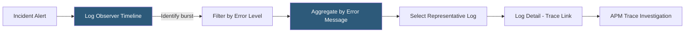

**Category:** Monitoring & Observability SaaS
**Difficulty:** Intermediate
**Reading time:** 5 min read

---

Splunk Log Observer is a code-free log investigation tool within the Splunk Observability Cloud designed to help DevOps and SRE teams query logs without writing SPL. It integrates directly with infrastructure metrics and distributed traces to provide contextual log access during incident investigation.

- **Log Observer Connect** — Feature linking Splunk Observability Cloud to a separate Splunk Platform (Enterprise or Cloud) deployment for querying existing indexed logs
- **Field Extractor** — Tool for defining field extraction rules from unstructured log text using a point-and-click interface
- **Log Timeline** — Histogram visualization of log volume over time enabling instant identification of log bursts correlating with incident start times
- **Aggregate View** — Grouping and counting logs by field value to surface dominant patterns without reading individual lines
- **Log Detail Panel** — Expanded view of a single log record showing all extracted fields and a link to the correlated trace
- **Filter Bar** — UI-driven log filtering interface enabling non-SPL users to narrow log searches by field value combinations
- **Saved Query** — Persistent log search configuration usable in dashboards and alert rules
- **Related Content** — Context panel surfacing correlated APM traces, infrastructure metrics, and RUM events for the log's service and time window

Log Observer is built for observability workflows rather than security or compliance use cases. Logs are ingested via the Splunk OpenTelemetry Collector configured with a log pipeline, which collects container stdout/stderr and file-based logs and forwards them to Splunk Observability's log ingest endpoint. Logs are associated with the service entity responsible for emitting them using the `service.name` OpenTelemetry resource attribute.

The Log Timeline view renders a time-bucketed histogram of log volume, color-coded by severity level. Engineers responding to an alert can immediately see if log volume or error rate changed at the time the alert fired, without writing any query. Clicking a histogram bar scopes the log list to that time window.

The Filter Bar accepts field-value pair inputs built through a point-and-click autocomplete UI. Field names are auto-suggested based on detected JSON keys and extracted fields. Multiple filter conditions are combined with AND/OR logic. The Aggregate view groups log records by a selected field and counts occurrences, surfacing patterns like "the top 3 error messages account for 92% of all errors in this window."

Log Observer Connect extends this interface to query logs already indexed in a customer's existing Splunk Platform deployment, allowing teams that have invested in Splunk Enterprise to access those logs from the unified Observability Cloud UI without re-ingesting data. Trace correlation works by matching the `trace_id` field in log records to spans in Splunk APM, enabling one-click navigation from an error log to the full distributed trace for that request.

- Allowing a developer unfamiliar with SPL to investigate log patterns during a P1 incident using the filter bar
- Identifying that 80% of error logs in a 10-minute window share the same database connection timeout message using Aggregate view
- Jumping directly from a 500 error log record to its correlated Splunk APM trace to see the full backend call chain
- Using Log Observer Connect to query existing Splunk Enterprise security logs during an observability investigation without a second login
- Creating a saved log filter for "ERROR logs from the payment service" as a dashboard panel for service health monitoring

| Advantage | Disadvantage |
|-----------|--------------|
| No-SPL interface reduces barrier for developers who are not log query experts | Limited query expressiveness compared to full SPL; complex analytical queries require switching to Splunk Platform |
| Trace correlation eliminates context switching between log and trace tools | Log Observer Connect requires a separate Splunk Platform license for customers using existing Splunk infrastructure |
| Log Timeline histogram provides immediate visual correlation of log volume to incident timeline | Field extraction requires logs to be structured JSON or have consistent patterns; freeform logs need manual rule creation |
| Related Content links surfaces infrastructure and RUM context without copy-pasting entity names | Log Observer is less mature than Splunk Core for compliance, long-term retention, and reporting use cases |

- [Splunk Cloud Platform](splunk-cloud-platform.md)
- [Splunk APM](splunk-apm.md)
- [Grafana Loki for Logs](grafana-loki-for-logs.md)

---
*Part of the [Monitoring & Observability SaaS](index.md) category · [Back to Master Index](../../index.md)*
