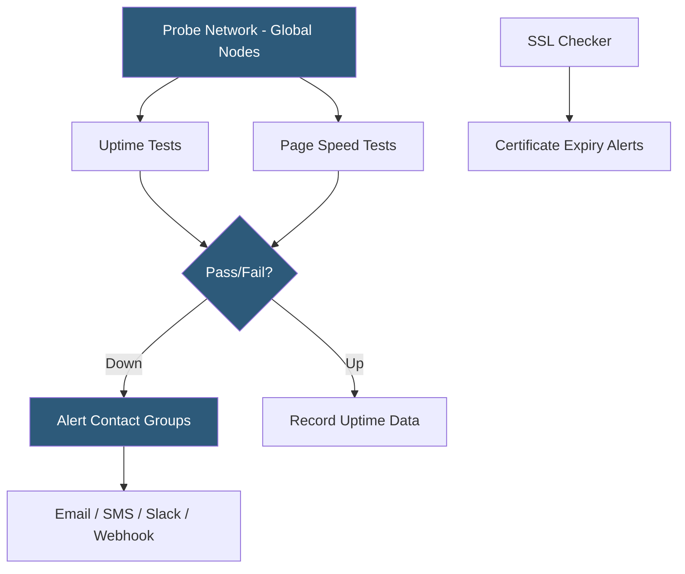

**Category:** Monitoring & Observability SaaS
**Difficulty:** Beginner
**Reading time:** 5 min read

---

StatusCake is a website monitoring platform offering uptime checks, page speed tests, domain/SSL expiry monitoring, and server monitoring at competitive pricing. It runs checks from a global probe network and provides public and private status pages for incident communication. StatusCake's free tier is notably generous, supporting unlimited uptime tests at 5-minute intervals.

- **Uptime test** — configurable HTTP/HTTPS availability check run from multiple probe locations
- **Page speed test** — scheduled full page load test with performance scoring and waterfall analysis
- **SSL monitoring** — checks for certificate expiry and configuration issues with advance alerts
- **Domain monitoring** — WHOIS-based domain expiry alerting to prevent accidental lapses
- **Server monitoring** — lightweight agent reporting CPU, RAM, disk, and network metrics
- **Contact groups** — shared alert destination sets applied across multiple tests
- **Maintenance windows** — scheduled alert suppression during planned downtime

StatusCake's probing infrastructure distributes checks across nodes in multiple countries, sending HTTP/HTTPS requests from the configured locations at intervals from 30 seconds (paid) to 5 minutes (free). Each check records the HTTP status code, response time, and header information. When a failure is detected, a second check is immediately dispatched from a different probe location to confirm the outage before alerting, reducing false positives from transient network issues.

StatusCake's page speed testing uses Google's Lighthouse engine to score pages against Web Vitals and performance best practices, generating waterfall charts and improvement recommendations. Tests can be scheduled on a recurring basis to track performance trends after deployments or infrastructure changes.

SSL monitoring independently checks certificate validity and expiry on a configurable schedule, sending alerts 14, 7, and 1 day before expiry. This complements uptime checks by catching certificate issues before they cause browser trust errors. Domain monitoring queries WHOIS data to alert on domain expiry, preventing accidental service disruption from lapsed registrations.

The server monitoring agent is a lightweight program installed on Linux or Windows servers that reports CPU, memory, disk, and network I/O metrics to StatusCake every minute. These metrics are displayed alongside uptime data, providing basic infrastructure context when investigating outages. While not a full APM platform, the agent gives teams a first-tier view of server resource utilization without deploying a more complex monitoring stack.

- Monitoring website uptime across global regions on a budget
- Receiving SSL certificate expiry alerts 14 days in advance
- Tracking page performance scores after UI changes
- Preventing domain expiry through WHOIS monitoring alerts
- Publishing a branded status page for SaaS customers

| Advantage | Disadvantage |
|-----------|--------------|
| Unlimited uptime tests on free tier | Check frequency limited to 5 minutes on free plan |
| SSL and domain expiry monitoring included | Server agent lacks depth of full APM solutions |
| Page speed scoring with Lighthouse integration | Less extensive probe network than Pingdom |
| Status page included on all plans | Limited alert routing compared to enterprise tools |

- [UptimeRobot Monitoring Service](uptimerobot-monitoring-service.md)
- [Pingdom Website Monitoring](pingdom-website-monitoring.md)
- [Checkly Synthetic Monitoring](checkly-synthetic-monitoring.md)

---
*Part of the [Monitoring & Observability SaaS](index.md) category · [Back to Master Index](../../index.md)*
