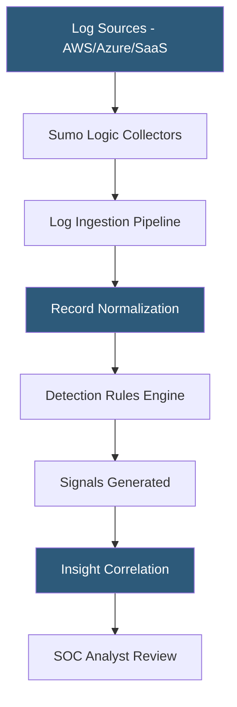

**Category:** Monitoring & Observability SaaS
**Difficulty:** Advanced
**Reading time:** 7 min read

---

Sumo Logic is a cloud-native analytics platform combining log management, infrastructure monitoring, and security operations into a single multi-tenant SaaS service. Its Cloud SIEM product ingests security events from across an organization's technology stack, normalizes them against a common schema, and applies threat detection rules and ML-based analytics to identify attacks and compliance violations in real time.

- **Cloud SIEM** — Security Information and Event Management delivered as SaaS without infrastructure management
- **Record normalization** — mapping raw log fields to Sumo Logic's Cloud SIEM schema for cross-source correlation
- **Signal** — a security indicator generated by a detection rule or ML model matching normalized records
- **Insight** — an automatically correlated cluster of related signals forming an actionable security case
- **Entity** — a user, IP address, hostname, or domain being tracked across signals
- **Detection rules** — logic-based or ML-based criteria that match patterns across normalized records
- **Continuous Intelligence** — Sumo Logic's architectural pattern for streaming analytics over log data

Sumo Logic ingests log data via hosted collectors (SaaS endpoints), installed collectors (running on-premises or in VMs), or cloud-native integrations with AWS S3, Azure Event Hubs, Google Cloud Pub/Sub, and SaaS applications (Office 365, Okta, Salesforce). All inbound data passes through a parsing pipeline where field extraction rules normalize vendor-specific log formats into the Cloud SIEM Common Schema, a standardized set of field names covering authentication, network, endpoint, and cloud activity events.

Normalized records are evaluated continuously against a library of detection rules maintained by Sumo Logic's threat intelligence team. Rules range from simple string matches (known malicious IPs from threat feeds) to complex behavioral patterns (impossible travel logins, credential stuffing velocity). Each matching record generates a Signal — a structured security finding with severity, confidence, entity references, and supporting evidence.

The Insight engine clusters related signals using entity resolution: signals sharing the same user, IP, or hostname within a configurable time window are grouped into an Insight, providing analysts with full attack context rather than thousands of individual alerts. Each Insight is assigned a severity based on the combined signal scores and threat actor profile.

Sumo Logic's threat intelligence integration enriches entities with known-malicious indicators from industry feeds (MITRE ATT&CK mapping, ISAC feeds). SOAR integrations (Palo Alto XSOAR, ServiceNow Security Operations) allow automated playbook execution triggered by Insight creation.

- Centralizing security logs from multi-cloud, SaaS, and on-premises environments
- Detecting account compromise through behavioral anomaly detection
- Mapping alerts to MITRE ATT&CK tactics for incident classification
- Maintaining audit trails for PCI DSS, HIPAA, and SOC 2 compliance
- Automating tier-1 SOC triage by correlating signals into prioritized Insights

| Advantage | Disadvantage |
|-----------|--------------|
| No SIEM infrastructure to manage | Per-GB ingest pricing escalates with log volume |
| Pre-built content library for hundreds of log sources | Rule customization requires familiarity with Sumo Logic query language |
| Unified log analytics and SIEM in one platform | ML-based signals may generate false positives during tuning period |
| Cloud-native scalability for burst log ingestion | Less mature than legacy SIEM vendors for some compliance use cases |

- [Splunk Cloud Platform](splunk-cloud-platform.md)
- [Elastic Observability](elastic-observability.md)
- [Datadog Log Management](datadog-log-management.md)

---
*Part of the [Monitoring & Observability SaaS](index.md) category · [Back to Master Index](../../index.md)*
