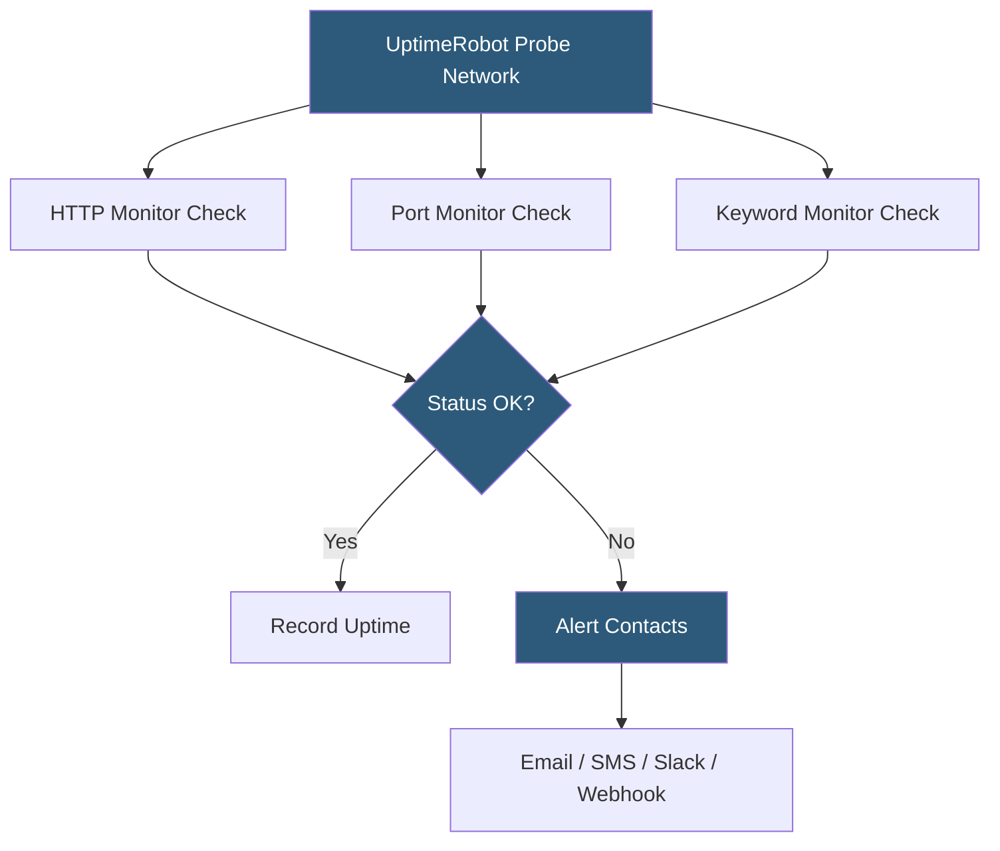

**Category:** Monitoring & Observability SaaS
**Difficulty:** Beginner
**Reading time:** 5 min read

---

UptimeRobot is a cloud-based uptime monitoring service that checks websites, APIs, ports, and keywords at configurable intervals (as low as 30 seconds on paid plans), alerting teams via email, SMS, Slack, PagerDuty, and webhooks when resources become unavailable. It provides a hosted status page feature for communicating incidents to users and maintains a 2-year history of uptime statistics.

- **Monitor** — a configured check targeting a specific URL, port, keyword, or heartbeat
- **Check interval** — frequency at which UptimeRobot polls the monitored resource
- **Alert contact** — notification destination (email, SMS, Slack, PagerDuty, webhook)
- **Status page** — publicly accessible uptime and incident communication page
- **Keyword monitor** — checks that a specific string is present (or absent) in the HTTP response body
- **Port monitor** — TCP connectivity check for non-HTTP services (databases, SMTP, custom ports)
- **Heartbeat monitor** — a push-based check where the monitored service sends a ping on schedule

UptimeRobot operates a global network of probing servers that send HTTP/HTTPS requests, TCP connection attempts, or ICMP pings to monitored targets at the configured interval. For HTTP monitors, the probe records the HTTP response code, response time, and optionally scans the body for a configured keyword. A monitor is considered "down" when the check returns a non-2xx status code, the connection times out, or the expected keyword is missing.

To reduce false positives from transient network issues, UptimeRobot confirms outages with multiple checks before firing an alert. The default confirmation behavior retries the check from a different probe location before declaring a monitor down. Alert contacts receive a notification with the outage start time, response code, and a link to the monitor's response time graph.

The status page feature generates a hosted page at a custom subdomain (e.g., `status.yourdomain.com`) displaying the current status and uptime percentages for all selected monitors. Incident updates can be posted manually or the page automatically reflects monitor state changes. Status pages support custom branding, SSL, and password protection for internal team use.

UptimeRobot's free plan supports up to 50 monitors at 5-minute intervals — sufficient for personal projects and small startups. Paid plans reduce the minimum interval to 30 seconds and add SMS alerts, HTTP headers for API authentication, maintenance windows, and response time graphs with granular historical data.

- Monitoring production website availability from external probes
- Alerting on API endpoint failures before users report issues
- Publishing a public status page during infrastructure incidents
- Checking SSL certificate expiry with HTTPS monitor alerts
- Verifying that a Kubernetes ingress or load balancer is responding

| Advantage | Disadvantage |
|-----------|--------------|
| Free tier supports 50 monitors at 5-minute intervals | 5-minute minimum interval on free plan misses brief outages |
| Zero infrastructure setup required | Not a replacement for deep APM or log monitoring |
| Hosted status pages included | Limited check customization (headers, auth) on free plan |
| Wide alert channel support | Response time metrics only — no trace or log context |

- [Pingdom Website Monitoring](pingdom-website-monitoring.md)
- [StatusCake Uptime Monitoring](statuscake-uptime-monitoring.md)
- [Checkly Synthetic Monitoring](checkly-synthetic-monitoring.md)

---
*Part of the [Monitoring & Observability SaaS](index.md) category · [Back to Master Index](../../index.md)*
