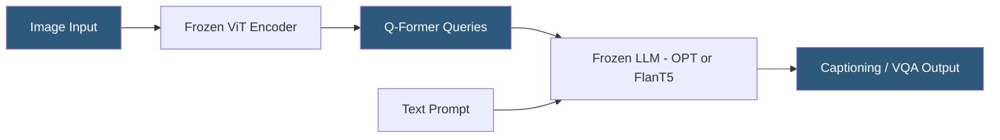

**Category:** Multimodal AI Platforms
**Difficulty:** Advanced
**Reading time:** 6 min read

---

BLIP (Bootstrapped Language-Image Pretraining) and its successor BLIP-2 are vision-language models from Salesforce Research designed for image captioning, visual question answering (VQA), and image-text retrieval. BLIP-2 introduces a Q-Former (Querying Transformer) bridging frozen image encoders and large language models, enabling multimodal understanding with significantly fewer trainable parameters than end-to-end approaches.

- **BLIP** — Salesforce's vision-language model using a unified encoder-decoder for captioning, VQA, and retrieval
- **BLIP-2** — improved architecture with a Q-Former connecting frozen image encoders to frozen LLMs
- **Q-Former** — the lightweight trainable bridge between image features and language model tokens
- **Bootstrapped pre-training** — using a captioner and filter iteratively to improve noisy web training data
- **Image captioning** — generating descriptive text from an image without a specific question
- **Visual QA (VQA)** — answering arbitrary natural language questions about image content
- **ITM (Image-Text Matching)** — binary classification of whether an image and text are semantically aligned

BLIP-2 decouples the visual and language components using a Q-Former architecture. The image encoder (typically EVA-ViT or CLIP-ViT) is kept frozen during training, as is the downstream language model (OPT-6.7B, OPT-2.7B, or FlanT5). Only the Q-Former — a small transformer with 32 learned query tokens — is trained, acting as a bottleneck that extracts the most language-relevant features from image encoder outputs.

During the first pre-training stage, the Q-Former is trained with the frozen image encoder on image-text matching, image-text contrastive learning, and image-grounded text generation objectives simultaneously. This teaches the Q-Former to encode visual information that is useful for language tasks. In the second stage, the Q-Former output is projected via a linear layer and prepended to the language model's input token sequence, conditioning the LLM on the visual content.

Hosting BLIP-2 requires loading two large frozen models (the ViT and the LLM) plus the small Q-Former. The FlanT5-XXL variant requires approximately 32GB VRAM; the OPT-2.7B variant runs in ~8GB VRAM for practical production deployment. Quantization (8-bit, 4-bit) using bitsandbytes significantly reduces memory requirements with modest accuracy loss.

The Hugging Face `transformers` library provides a ready-to-use `Blip2ForConditionalGeneration` class for inference. The model is deployed behind a FastAPI or Triton server for production API serving, typically on A100 or RTX 3090/4090 hardware.

- Generating accessible alt-text descriptions for large image libraries
- Answering natural language questions about product images in e-commerce
- Building image content moderation systems with descriptive explanation output
- Creating automated image tagging systems for digital asset management
- Research applications requiring image-to-text reasoning capabilities

| Advantage | Disadvantage |
|-----------|--------------|
| Q-Former enables efficient use of frozen pre-trained models | Large GPU memory requirements for FlanT5-XXL variants |
| Strong VQA performance without task-specific fine-tuning | Slower inference than CLIP for pure embedding tasks |
| Open-source on Hugging Face — self-hostable | Two-stage pretraining complicates custom fine-tuning |
| Supports multiple LLM backends for different accuracy/cost trade-offs | BLIP-2 is being superseded by InstructBLIP and newer VLMs |

- [CLIP Model API](clip-model-api.md)
- [Visual Question Answering (VQA)](visual-question-answering-vqa.md)
- [LLaVA Multimodal Deployment](llava-multimodal-deployment.md)

---
*Part of the [Multimodal AI Platforms](index.md) category · [Back to Master Index](../../index.md)*
