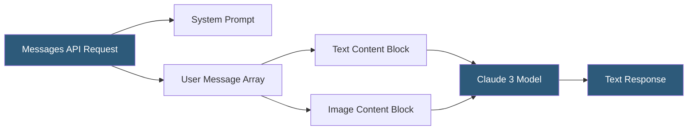

**Category:** Multimodal AI Platforms
**Difficulty:** Intermediate
**Reading time:** 6 min read

---

Claude 3 (Haiku, Sonnet, and Opus) from Anthropic includes native vision capabilities that allow images to be passed alongside text prompts through the Messages API. Claude 3 models are particularly noted for their accuracy in reading dense text within images, interpreting complex charts and technical diagrams, and reasoning carefully about ambiguous visual content with honest uncertainty acknowledgment.

- **Messages API** — Anthropic's primary API accepting image and text content blocks
- **Base64 image encoding** — images transmitted as base64-encoded strings with media type headers
- **Image URL source** — direct URL image source accepted in newer Claude versions
- **Content block** — the structured unit (text or image) within the messages array
- **Media type** — MIME type declaration (`image/jpeg`, `image/png`, `image/gif`, `image/webp`)
- **Vision accuracy** — Claude's relative strength in reading text within images and charts
- **Refusal calibration** — Anthropic's Constitutional AI training reduces hallucinated image descriptions

Claude 3's vision capability is accessed through the Messages API by including `image` content blocks in the messages array. Each image block specifies a `source` object with `type: "base64"` and a base64-encoded image string plus the image media type, or `type: "url"` for direct URL references. Multiple images can be interleaved with text blocks in the same message, up to a maximum of 20 images per request.

Claude processes images at their native resolution (up to a maximum of 8000 × 8000 pixels, capped at approximately 5 MB after encoding), with the model's internal representation maintaining high fidelity for detail-sensitive tasks. Unlike some alternatives, Claude does not apply a fixed tiling strategy based on detail levels; the model processes the full image content. Image tokens are calculated based on dimensions: a 1092 × 1092 pixel image costs approximately 1,590 input tokens.

Claude 3 demonstrates strong performance on tasks requiring careful reading of text within images — invoices, legal documents, screenshots, handwritten notes — and on interpreting scientific charts, architectural diagrams, and medical imaging. The Constitutional AI training that underpins Claude's design means it is calibrated to express uncertainty when image content is ambiguous rather than confabulating details.

Vision inputs trigger the same rate limit pools as text requests, measured in input tokens. Prompt caching is available for the system prompt and initial conversation turns, which can reduce costs significantly for pipelines that reuse the same system context across many vision requests.

- Extracting structured data from handwritten and printed forms
- Interpreting scientific figures and charts in research workflows
- Automating invoice and receipt processing with high OCR accuracy
- Analyzing screenshots for automated QA testing pipelines
- Building accessibility tools that generate detailed image alt-text

| Advantage | Disadvantage |
|-----------|--------------|
| Strong text-in-image reading accuracy | Cannot generate images — text output only |
| Calibrated uncertainty reduces confabulation risk | Per-image token cost grows with resolution |
| Up to 20 images per request for batch analysis | No audio modality in Claude 3 series |
| Prompt caching reduces repeated-context costs | URL image source requires publicly accessible URLs |

- [GPT-4o Multimodal API](gpt-4o-multimodal-api.md)
- [Gemini Multimodal API](gemini-multimodal-api.md)
- [Visual Question Answering (VQA)](visual-question-answering-vqa.md)

---
*Part of the [Multimodal AI Platforms](index.md) category · [Back to Master Index](../../index.md)*
