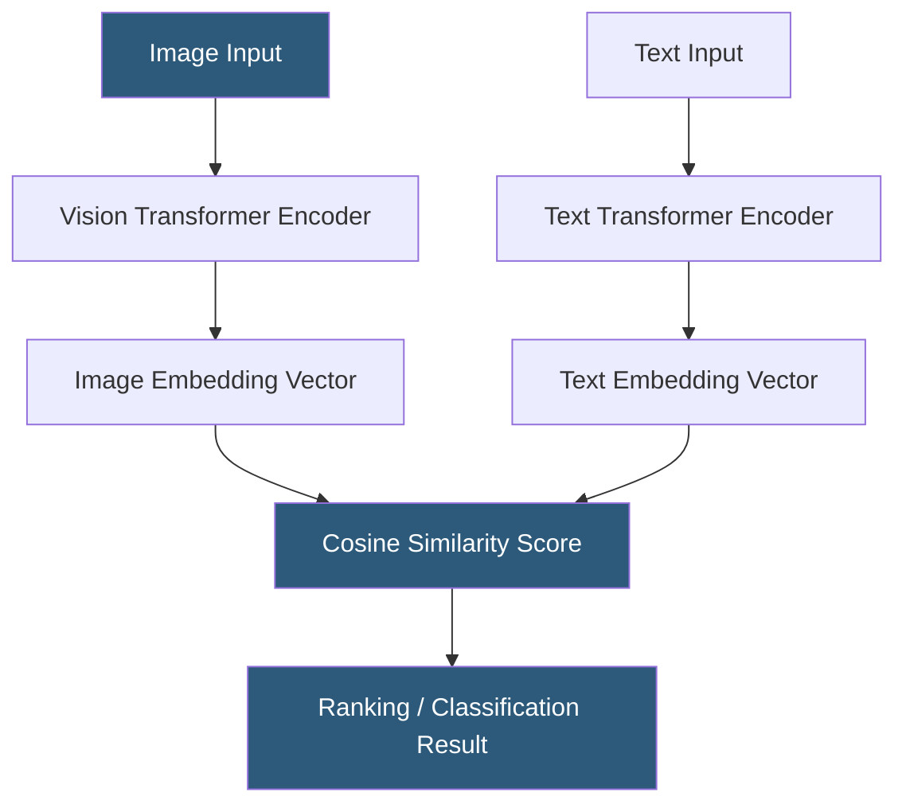

**Category:** Multimodal AI Platforms
**Difficulty:** Advanced
**Reading time:** 6 min read

---

CLIP (Contrastive Language-Image Pretraining) is OpenAI's model that learns joint embeddings for images and text, enabling zero-shot image classification, cross-modal similarity search, and semantic image retrieval without task-specific fine-tuning. Deployed as an API or self-hosted model, CLIP powers image search engines, content moderation systems, and the conditioning mechanism in many diffusion models including DALL-E.

- **Joint embedding space** — a shared vector space where semantically related images and texts are positioned near each other
- **Contrastive pretraining** — training objective that pulls matching image-text pairs together and pushes unmatched pairs apart
- **Zero-shot classification** — classifying images against arbitrary text labels without task-specific training data
- **ViT (Vision Transformer)** — the image encoder architecture used in CLIP models
- **Text encoder** — the transformer model that encodes text prompts into embedding vectors
- **Cosine similarity** — the metric used to compare CLIP embeddings for ranking relevance
- **CLIP score** — a relevance metric between an image and a text description derived from embedding dot product

CLIP was trained on 400 million image-text pairs scraped from the internet. The training objective — contrastive learning — uses two encoders: a Vision Transformer (ViT) for images and a transformer for text. During training, the model learns to maximize cosine similarity between the embedding of an image and its corresponding caption while minimizing similarity with all other captions in the batch.

The resulting joint embedding space enables cross-modal operations at inference time. Given an image, its ViT-encoded embedding can be compared against embeddings of arbitrary text strings to find the most semantically aligned label — enabling zero-shot classification without any labeled training data for the target categories. For example, embedding an image of an ambulance and computing its similarity against the text embeddings "ambulance," "fire truck," and "police car" returns the highest similarity for "ambulance," correctly classifying it without having been specifically trained on medical vehicle classification.

CLIP is commonly deployed via Hugging Face's `transformers` library (both ViT encoders and text encoders), or self-hosted on inference servers using Triton or FastAPI. The OpenCLIP project provides larger and more capable CLIP variants trained on larger datasets (LAION-2B). SigLIP (Google's variant) improves upon CLIP's training objective for better embedding quality.

CLIP embeddings are the conditioning signal for DALL-E's generation process, ensuring generated images align with text prompts. They are also used in Stable Diffusion's CLIP text encoder for the same purpose.

- Building semantic image search engines where users query images with natural language
- Implementing zero-shot image classification for content moderation
- Ranking AI-generated images by relevance to a prompt using CLIP score
- Powering visual recommendation systems with text-to-image similarity
- Creating multimodal content tagging pipelines without supervised labels

| Advantage | Disadvantage |
|-----------|--------------|
| Zero-shot classification — no per-category training data needed | CLIP embeddings are not well-calibrated for fine-grained distinctions |
| Shared image-text space enables cross-modal search | Biases from web training data propagate to embedding space |
| Foundation for diffusion model conditioning | Lower quality than specialized models for specific tasks |
| Open-source variants (OpenCLIP, SigLIP) available | Large model sizes require significant GPU memory for inference |

- [BLIP Model Hosting](blip-model-hosting.md)
- [Multimodal Embeddings API](multimodal-embeddings-api.md)
- [Image-Text Retrieval Services](image-text-retrieval-services.md)

---
*Part of the [Multimodal AI Platforms](index.md) category · [Back to Master Index](../../index.md)*
