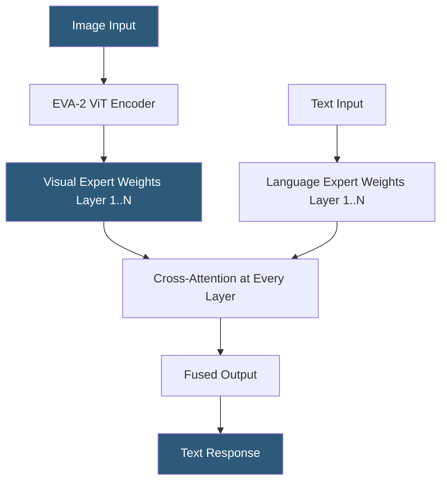

**Category:** Multimodal AI Platforms
**Difficulty:** Advanced
**Reading time:** 6 min read

---

CogVLM is an open-source vision-language model from Tsinghua University and Zhipu AI that achieves deep image-language fusion by adding dedicated visual expert weights to each transformer layer, unlike models that freeze the language backbone. CogVLM2 extends the architecture with higher resolution support and video understanding, and Zhipu AI provides a hosted API (GLM-4V) for production deployment without self-managed infrastructure.

- **Visual expert** — additional attention and FFN weights for processing visual tokens at each transformer layer
- **Shallow alignment vs deep fusion** — CogVLM's approach trains visual experts throughout all layers, unlike BLIP-2 or LLaVA's shallow projection
- **CogVLM2** — updated architecture supporting 1344×1344 input resolution and video frames
- **CogAgent** — CogVLM variant trained for GUI understanding and computer use tasks
- **GLM-4V** — Zhipu AI's hosted API version of the CogVLM model family
- **High-resolution patching** — tiling high-resolution images into sub-patches for detail-preserving processing
- **Visual grounding** — referring expression comprehension and bounding box prediction tasks

CogVLM's architecture differs from BLIP-2 and LLaVA in how visual information is integrated into the language model. Rather than using a shallow projection layer that maps visual features into the LLM's input space, CogVLM adds dedicated "visual expert" modules — separate attention projection matrices (Q, K, V, out) and FFN layers — at every transformer layer in the language model. During forward computation, visual tokens use the visual expert weights while language tokens use the original LLM weights, with cross-attention allowing bidirectional information flow at each layer.

This deep fusion allows richer integration of visual semantics throughout all levels of language processing, rather than only at the input layer. The result is stronger visual grounding and more accurate responses to questions requiring fine-grained visual detail.

CogVLM uses EVA-2 (a high-capacity ViT pre-trained by BAAI) as its visual encoder, processing images at 490×490 pixels in the base model and up to 1344×1344 in CogVLM2 through dynamic high-resolution patching. CogAgent, a variant fine-tuned on GUI screenshots and computer interaction data, achieves state-of-the-art performance on web navigation and computer use tasks.

Self-hosting requires 38–80GB VRAM depending on the model variant and quantization: CogVLM-17B in fp16 requires ~40GB, making A100 80GB or multi-GPU setups necessary. 4-bit quantization reduces VRAM to approximately 12–16GB at a quality cost. Zhipu AI's GLM-4V API eliminates infrastructure management.

- High-fidelity image analysis requiring deep visual-linguistic reasoning
- GUI interaction and computer use automation using CogAgent
- Detailed chart and diagram understanding for scientific or financial documents
- Self-hosted multimodal inference where model accuracy is prioritized over deployment simplicity
- Research into deep fusion vision-language architectures

| Advantage | Disadvantage |
|-----------|--------------|
| Deep fusion produces stronger visual grounding than shallow projection | Very high VRAM requirements for full precision deployment |
| CogAgent specialized for GUI/computer use tasks | Chinese language ecosystem — smaller English developer community |
| Open weights available for self-hosting | Zhipu AI GLM-4V API primarily targeting Chinese cloud market |
| CogVLM2 supports high-resolution and video | Deployment complexity higher than Ollama-supported models |

- [LLaVA Multimodal Deployment](llava-multimodal-deployment.md)
- [Qwen-VL Multimodal Models](qwen-vl-multimodal-models.md)
- [BLIP Model Hosting](blip-model-hosting.md)

---
*Part of the [Multimodal AI Platforms](index.md) category · [Back to Master Index](../../index.md)*
