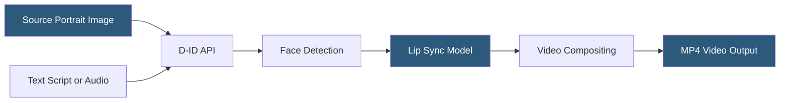

**Category:** Multimodal AI Platforms
**Difficulty:** Intermediate
**Reading time:** 5 min read

---

D-ID is an AI video synthesis platform that animates still images into talking avatar videos using text or audio input. Its Creative Reality Studio and REST API enable developers to create photo-realistic talking head videos from a single facial photo, supporting applications from personalized customer communications to digital human interfaces for conversational AI systems.

- **Talking head video** — a video of a face speaking, generated from a still image and audio
- **Driver audio** — the input speech audio or text that the face is animated to lip-sync with
- **Source image** — the still portrait photograph animated into the talking head
- **Clips API** — D-ID's endpoint for generating short talking head video clips
- **Agents API** — D-ID's API for streaming interactive digital humans in real-time conversation
- **Presenter** — D-ID's term for a pre-built or custom animated avatar
- **Face detection** — automatic detection of the face region in the source image for animation focus

D-ID's core capability is animating static facial images into synchronized talking videos. The `POST /clips` API endpoint accepts a source image URL (or a pre-built presenter ID from D-ID's library), and either a text script (which D-ID synthesizes using its internal TTS engine) or a URL to pre-recorded audio. The response is asynchronous — a clip ID is returned immediately, and the caller polls `GET /clips/{id}` until the status is `done` and a video URL is returned.

The animation pipeline uses a neural rendering model trained to generate realistic facial motion — jaw movement, lip shape, subtle facial muscle dynamics — from phoneme sequences derived from the audio. The model outputs a video layer showing only the face in motion, which is composited back onto the original image background. A separate scene model applies realistic head pose variation and blink animation to avoid the "frozen mannequin" effect of purely lip-sync approaches.

The Agents API extends the platform to real-time interactive digital humans. Instead of asynchronous clip generation, the Agents API uses a WebRTC stream: the developer sends text or audio and receives a live video stream of the avatar speaking in near real-time (typically 1–2 second latency from text input to video output). This enables interactive customer service avatars, AI-powered receptionists, and embodied conversational AI interfaces.

D-ID's web application provides a no-code interface for creating presenter libraries, managing source images, and previewing generated clips before API integration.

- Building personalized video messages for sales and marketing automation
- Creating interactive digital human agents for customer service kiosks
- Generating accessible video explainers with a presenter from article or FAQ text
- Building multilingual video content by swapping TTS language on the same source image
- Animating historical photographs for educational and documentary content

| Advantage | Disadvantage |
|-----------|--------------|
| Single photo required — no video recording needed | Synthetic appearance detectable at close inspection |
| Real-time streaming via Agents API for interactive use | Background behind the source image cannot be changed |
| Built-in TTS in 100+ languages | Source image quality directly affects output quality |
| Simple REST API with minimal parameters | Limited head movement range compared to full-body avatars |

- [Synthesia Video Generation API](synthesia-video-generation-api.md)
- [HeyGen Avatar API](heygen-avatar-api.md)
- [Fliki Text-to-Video](fliki-text-to-video.md)

---
*Part of the [Multimodal AI Platforms](index.md) category · [Back to Master Index](../../index.md)*
