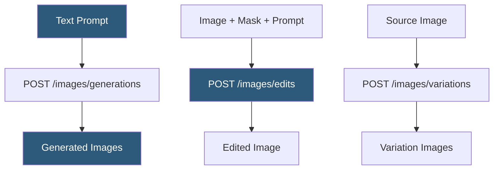

**Category:** Multimodal AI Platforms
**Difficulty:** Beginner
**Reading time:** 5 min read

---

DALL-E 2 is OpenAI's second-generation image generation model offering text-to-image generation, image editing (inpainting), and image variation creation. Unlike DALL-E 3, it supports generating up to 10 images per API call, editing existing images using mask regions, and creating stylistic variations from an input image — making it more flexible for iterative creative workflows.

- **Text-to-image** — generating a new image from a text description
- **Inpainting** — editing a masked region of an existing image using a text prompt
- **Image variations** — generating stylistic variants of an uploaded image
- **Mask** — a PNG image with transparent regions indicating areas to regenerate
- **CLIP** — the image-text alignment model underlying DALL-E 2's latent space
- **Generation size** — supported sizes: 256×256, 512×512, 1024×1024 pixels
- **Prompt sensitivity** — DALL-E 2's tendency to interpret prompts more literally than DALL-E 3

DALL-E 2 exposes three API endpoints. The generations endpoint (`POST /v1/images/generations`) accepts a text prompt and returns 1–10 generated images in the specified size. Unlike DALL-E 3, the prompt is used verbatim without automatic revision, giving developers precise control over the input but requiring more carefully engineered prompts for quality results.

The edits endpoint (`POST /v1/images/edits`) accepts a source PNG image, an optional mask PNG with transparent pixels marking the region to edit, and a text prompt describing what to place in the masked area. This inpainting capability allows selective modification of existing images — replacing backgrounds, adding objects, or removing elements — using natural language instructions. Both the source image and mask must be square PNGs of equal size (256×256, 512×512, or 1024×1024).

The variations endpoint (`POST /v1/images/variations`) accepts a source image and returns stylistically similar variants without requiring a text prompt. This is useful for exploring alternatives to an approved design or generating product image variations for A/B testing.

DALL-E 2's underlying architecture combines a CLIP image encoder trained on text-image pairs with a diffusion decoder conditioned on CLIP embeddings. The image quality and resolution (max 1024×1024) are lower than DALL-E 3, and the model struggles with coherent text rendering within images, but its editing and variation capabilities and multi-image generation per call make it a practical choice for programmatic creative workflows.

- Removing and replacing image backgrounds at scale for e-commerce product photos
- Generating multiple image options per prompt for A/B testing creative assets
- Creating product image variations from a single hero shot
- Building creative tools requiring iterative image editing with natural language
- Generating synthetic training image datasets with variations

| Advantage | Disadvantage |
|-----------|--------------|
| Up to 10 images per API call | Lower resolution and quality than DALL-E 3 |
| Inpainting for selective image editing | No automatic prompt enhancement |
| Image variations from existing uploads | Weak text rendering within generated images |
| Verbatim prompt control for precise pipelines | 1024×1024 maximum resolution limits print use |

- [DALL-E 3 API](dall-e-3-api.md)
- [Stable Diffusion API Hosting](stable-diffusion-api-hosting.md)
- [Stability.ai API](stability-ai-api.md)

---
*Part of the [Multimodal AI Platforms](index.md) category · [Back to Master Index](../../index.md)*
