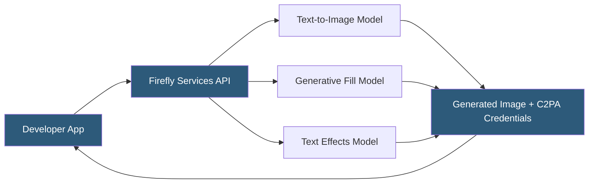

**Category:** Multimodal AI Platforms
**Difficulty:** Intermediate
**Reading time:** 6 min read

---

Adobe Firefly is a family of generative AI models designed for commercial creative use, available through Adobe's Firefly Services API. Firefly is trained exclusively on licensed content, including Adobe Stock and public domain works, positioning it as a commercially safe alternative to models trained on scraped web data. It offers text-to-image, generative fill, text effects, and vector generation capabilities.

- **Commercially safe training data** — Firefly is trained on licensed and public domain content only
- **Generative Fill** — AI-powered inpainting for selective content replacement in images
- **Generative Expand** — outpainting capability extending image boundaries with generated content
- **Content Credentials** — C2PA-compatible metadata recording AI generation provenance
- **Firefly Services** — Adobe's enterprise API platform for programmatic Firefly access
- **Style reference** — an uploaded image used to guide the visual style of generated output
- **Structure reference** — a reference image guiding the spatial composition of generated images

Adobe Firefly Services provides a REST API for programmatic access to Firefly generation capabilities. Authentication uses Adobe's Identity Management System (IMS) via OAuth 2.0 service account credentials, producing access tokens scoped to specific Firefly capabilities. The API endpoints cover text-to-image generation, generative fill (inpainting with a source image and mask), image expansion (outpainting), and text effects (stylized text rendering).

Text-to-image requests accept a prompt, optional negative prompt, output size (multiple aspect ratios and pixel dimensions up to 2688×2688), style presets (from a library of visual styles like "watercolor," "oil painting," "pixel art"), and optionally a style reference image that transfers visual characteristics from an uploaded example into the generated output. The `structure_reference` parameter uses depth and edge information from a reference image to guide spatial composition without transferring its appearance.

Every image generated by Firefly includes Content Credentials — metadata conforming to the Coalition for Content Provenance and Authenticity (C2PA) standard. These credentials record that the image was AI-generated using Adobe Firefly and are embedded in the file's XMP metadata, surviving most standard file operations. This provenance system is designed for enterprise customers who need to demonstrate AI content governance in their creative workflows.

The commercial safety positioning is a core differentiator: Adobe indemnifies enterprise Firefly Services customers against intellectual property infringement claims stemming from Firefly-generated content, providing legal coverage that purely open models or scrape-trained models cannot offer.

- Generating marketing imagery at scale with legal indemnification coverage
- Automating background replacement in product photography pipelines
- Creating text effects and typographic treatments for brand campaigns
- Building generative expand features in photo editing applications
- Producing AI-generated content with provenance metadata for compliance

| Advantage | Disadvantage |
|-----------|--------------|
| Commercial IP indemnification from Adobe | Requires Adobe IMS authentication — more complex than API key |
| C2PA Content Credentials for AI provenance | Output quality sometimes less creative than Midjourney or SDXL |
| Commercially licensed training data — legally defensible | API pricing higher than some alternatives at scale |
| Generative fill and expand capabilities built-in | Smaller model ecosystem — no community fine-tunes |

- [DALL-E 3 API](dall-e-3-api.md)
- [Imagen API (Google)](imagen-api-google.md)
- [Leonardo.ai API](leonardo-ai-api.md)

---
*Part of the [Multimodal AI Platforms](index.md) category · [Back to Master Index](../../index.md)*
