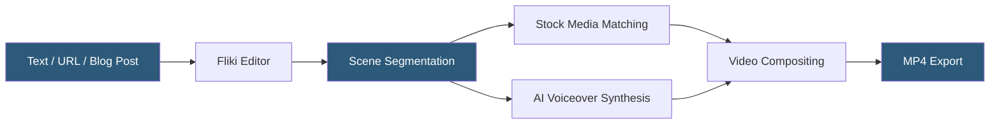

**Category:** Multimodal AI Platforms
**Difficulty:** Beginner
**Reading time:** 5 min read

---

Fliki is a text-to-video platform that converts written scripts, blog articles, or URLs into narrated video slideshows using AI-generated voiceovers and stock media. It targets content creators, marketers, and educators who need to produce video content rapidly without video editing expertise. Fliki's workflow converts text paragraphs into video scenes, with each scene displaying relevant stock footage or images paired with synthesized narration.

- **Text-to-video workflow** — converting a written document or URL into a narrated video automatically
- **AI voiceover** — neural TTS narration generated from the script text in 75+ languages
- **Scene** — a video segment combining one clip of stock footage with a narration sentence
- **Media library** — integrated Storyblocks/Getty stock footage accessed within Fliki
- **Voice cloning** — optional custom voice creation from a 30-second recording sample
- **Avatar mode** — AI talking head presenter added as an overlay on video scenes
- **Caption generation** — automatic subtitle generation from the synthesized narration audio

Fliki's core workflow begins with a text input: the user pastes a script, enters a blog post URL (which Fliki scrapes and segments), or uses Fliki's AI to generate a script from a topic description. The platform automatically segments the text into individual scenes, typically one sentence or phrase per scene, and assigns each scene a duration based on the estimated narration length.

For each scene, Fliki searches its integrated media library (Storyblocks and Getty stock footage) using keywords extracted from the scene text, presenting suggested stock clips. Users can accept the suggestion or search manually. The platform also supports uploading custom video clips or images as scene backgrounds.

AI voiceover is generated scene-by-scene using the selected TTS voice from Fliki's library of 2,000+ voices across 75 languages and accents. Voice cloning allows users to record a 30-second audio sample and generate a custom voice that narrates all subsequent content in their style. Captions are automatically generated from the synthesized audio and displayed on screen.

Fliki operates primarily as a web-based editor rather than a developer API platform. Its positioning is as a self-serve content creation tool, not a programmatic generation service. Batch video creation is available through file uploads (CSV-based script input), making it possible to produce multiple videos from structured data without manual scene editing for each video.

- Converting existing blog articles into social media video content
- Producing multilingual voiceover narrations for educational content
- Creating product demonstration slideshows with AI narration for e-commerce
- Generating training video content from text documentation without video production
- Building localized version libraries of a video in multiple languages

| Advantage | Disadvantage |
|-----------|--------------|
| No video editing skills required — text-in, video-out | Web interface — limited programmatic API for developers |
| 2,000+ TTS voices in 75 languages built in | Video style limited to stock footage slideshow format |
| Integrated stock media library — no separate licensing | Avatar mode quality less photorealistic than Synthesia |
| Batch CSV input for multi-video production | Stock footage matching sometimes requires manual correction |

- [Synthesia Video Generation API](synthesia-video-generation-api.md)
- [D-ID Video Synthesis](d-id-video-synthesis.md)
- [Descript Video Editing API](descript-video-editing-api.md)

---
*Part of the [Multimodal AI Platforms](index.md) category · [Back to Master Index](../../index.md)*
