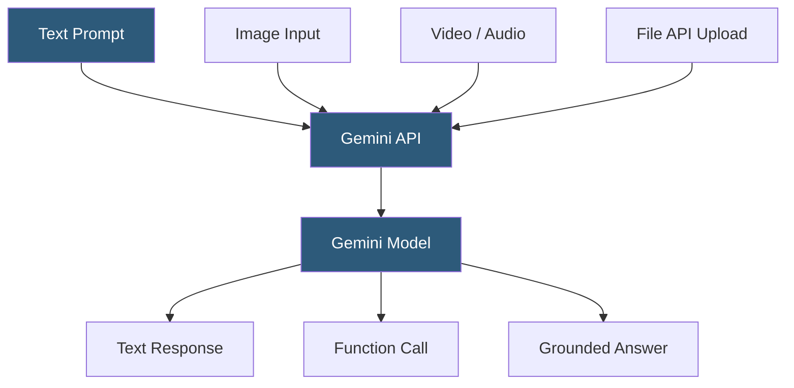

**Category:** Multimodal AI Platforms
**Difficulty:** Intermediate
**Reading time:** 6 min read

---

Google's Gemini family of models (Ultra, Pro, Flash, Nano) are natively multimodal, supporting text, images, audio, video, and code as inputs through the Gemini API. Gemini's standout capability is its long context window — up to 2 million tokens for Gemini 1.5 Pro — which enables processing entire hour-long videos, large codebases, or hundreds of images in a single API call.

- **Gemini 1.5 Pro** — Google's flagship long-context model supporting up to 2M token context
- **Gemini Flash** — cost-optimized, lower-latency variant for high-volume multimodal tasks
- **Inline data** — base64-encoded media passed directly in the API request body
- **File API** — Google's service for uploading large media files before referencing in prompts
- **Video frame sampling** — how Gemini samples frames from video inputs for analysis
- **Grounding** — augmenting Gemini responses with real-time Google Search results
- **Multimodal embeddings** — vector representations of text and images for cross-modal retrieval

The Gemini API (available through Google AI Studio and Vertex AI) accepts multimodal content via the `generateContent` endpoint. For inline media, content parts include a `inlineData` field with a base64-encoded blob and a MIME type. For larger files or video, the File API allows uploading media in advance and referencing it by URI in subsequent prompts — files are stored for 48 hours and can be reused across multiple requests.

Gemini's architecture was trained end-to-end on interleaved multimodal data, giving it native understanding of relationships across modalities. Video input is handled by sampling frames at approximately 1 frame per second for the 1.5 Pro model, with audio tracks processed alongside. This allows queries like "what was the main topic discussed at the 23-minute mark?" against an uploaded video recording.

The 2M token context window in Gemini 1.5 Pro is the most distinctive technical feature. An hour of video consumes roughly 100K tokens; a 1,500-page PDF fits within the window. Developers working with large document collections or multi-session conversations benefit from fitting entire documents into context rather than building retrieval systems, though cost scales linearly with context length.

Grounding integrates Google Search results into responses at query time, with citations returned alongside the generated text. This enables factual accuracy for knowledge cutoff-sensitive queries. Multimodal embeddings (available via the Embeddings API) produce a shared vector space for text and images, enabling cross-modal similarity search.

- Analyzing hour-long meetings or lectures from video uploads
- Processing entire technical documentation PDFs in a single prompt
- Building cross-modal search over mixed image-text document collections
- Generating descriptions and metadata for large image libraries
- Creating grounded research assistants that verify claims against live search results

| Advantage | Disadvantage |
|-----------|--------------|
| 2M token context handles very large documents and videos | Very long contexts dramatically increase latency and cost |
| Native video and audio processing without frame extraction | File API 48-hour storage limit requires pipeline management |
| Google Search grounding for factual accuracy | Vertex AI adds setup complexity versus direct Gemini API |
| Multimodal embeddings for cross-modal retrieval | Flash model has reduced accuracy vs Pro for complex reasoning |

- [Gemini Pro Vision](gemini-pro-vision.md)
- [GPT-4o Multimodal API](gpt-4o-multimodal-api.md)
- [Multimodal Embeddings API](multimodal-embeddings-api.md)

---
*Part of the [Multimodal AI Platforms](index.md) category · [Back to Master Index](../../index.md)*
