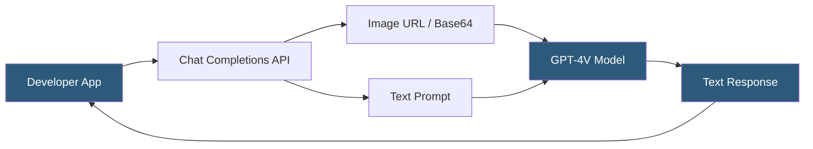

**Category:** Multimodal AI Platforms
**Difficulty:** Intermediate
**Reading time:** 6 min read

---

GPT-4 Vision (GPT-4V) was OpenAI's first generally available vision-language model, enabling developers to pass images alongside text prompts through the Chat Completions API. It accepts images via URL or base64-encoded data URLs and reasons about visual content using the same API surface as text-only GPT-4, making integration straightforward for teams already using OpenAI's SDK.

- **Vision-language model (VLM)** — a model trained to understand both image and text inputs jointly
- **Image token** — how image pixels are encoded and counted for billing purposes in GPT-4V
- **Detail parameter** — `low` (512px) vs `high` (full resolution) image processing mode
- **Multimodal context window** — the combined token budget for images and text in one request
- **Image URL** — external HTTP URL or base64-encoded data URL accepted as image input
- **Visual reasoning** — the model's ability to answer questions about image content
- **System prompt** — text instruction setting the model's behavior when processing images

GPT-4V integrates vision capability into the standard OpenAI Chat Completions API by extending the message content field to accept an array of content blocks. Each block can be either a `text` type or an `image_url` type, allowing developers to interleave images and text in the same message. The image can be provided as a publicly accessible HTTPS URL or as a base64-encoded data URL embedded directly in the request payload.

Images are internally preprocessed into a sequence of image tokens that the model attends to alongside text tokens. The `detail` parameter controls resolution: `low` mode tiles the image into a single 512×512 representation (85 tokens), while `high` mode tiles the full-resolution image into 512×512 chunks (a 1024×768 image uses 765 tokens). Token cost scales with image resolution in high mode, so large images significantly affect pricing and latency.

GPT-4V can describe image content, answer visual questions, extract text from images (OCR), compare multiple images, and reason about spatial relationships, charts, diagrams, and screenshots. It does not generate images — it exclusively processes images and produces text output.

The API does not retain images between requests; each API call must include the full image payload. Developers building pipelines with repeated image analysis should cache model outputs rather than resubmitting images. Rate limits apply to both token throughput and image throughput, with image-heavy workloads consuming token budget faster than text-only requests.

- Automating document and invoice data extraction from uploaded image files
- Building accessibility tools that describe images for visually impaired users
- Analyzing user-uploaded screenshots for technical support automation
- Processing medical imaging reports to extract structured data
- Validating design mockups against specification documents

| Advantage | Disadvantage |
|-----------|--------------|
| Same API surface as text GPT-4 — minimal code changes | High-resolution images consume large token budgets |
| Strong general visual reasoning and OCR capability | Cannot generate or edit images |
| Interleave text and multiple images in one request | No image caching — each request re-uploads the image |
| Supports both URL references and base64 images | Latency higher than text-only requests due to image processing |

- [GPT-4o Multimodal API](gpt-4o-multimodal-api.md)
- [Claude 3 Vision Capabilities](claude-3-vision-capabilities.md)
- [Gemini Multimodal API](gemini-multimodal-api.md)

---
*Part of the [Multimodal AI Platforms](index.md) category · [Back to Master Index](../../index.md)*
