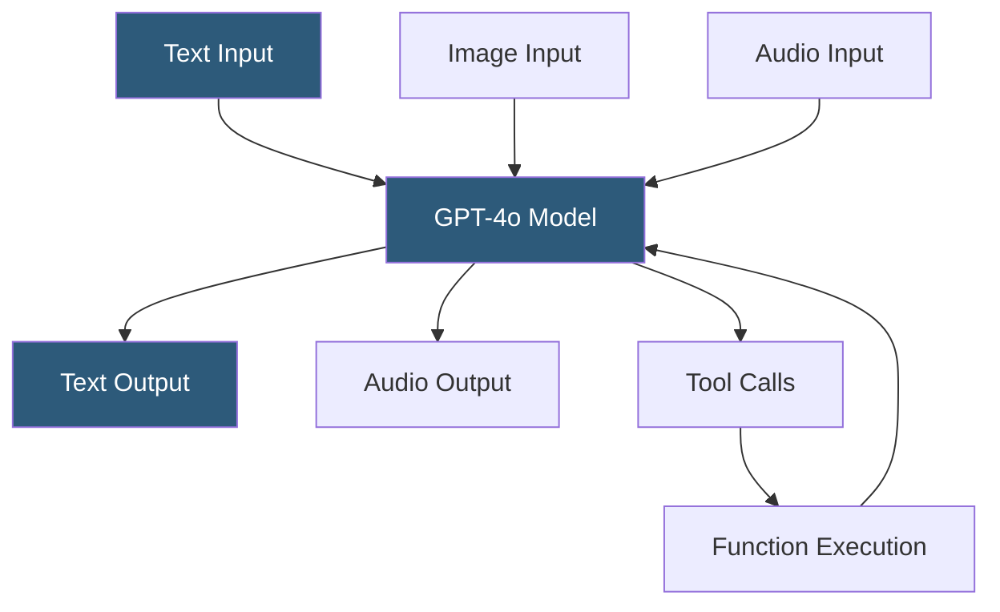

**Category:** Multimodal AI Platforms
**Difficulty:** Intermediate
**Reading time:** 6 min read

---

GPT-4o ("omni") is OpenAI's native multimodal model that processes and generates text, images, and audio in a unified architecture — unlike GPT-4V, which was a text model extended with vision. GPT-4o achieves lower latency for vision tasks, supports real-time audio input/output through the Realtime API, and delivers GPT-4-level text quality at lower cost per token.

- **Native multimodality** — the model was trained on all modalities simultaneously, not fine-tuned for vision post-hoc
- **Realtime API** — WebSocket-based API for low-latency audio streaming with GPT-4o
- **Voice mode** — end-to-end speech-to-speech without separate STT/TTS pipeline steps
- **Structured outputs** — JSON schema-enforced response format for reliable data extraction
- **Function calling** — tool invocation from vision and text inputs in the same request
- **Image generation** — GPT-4o Images can generate and edit images (separate endpoint)
- **Context window** — 128K token context supporting long conversations with multiple images

GPT-4o uses a unified transformer architecture trained end-to-end on interleaved text, image, and audio tokens. This native multimodality means the model processes cross-modal relationships during training rather than routing inputs through separate specialist models, resulting in better integration of information across modalities and lower inference latency compared to GPT-4V.

The Chat Completions API for GPT-4o accepts the same message format as GPT-4V but with enhanced capabilities. Images are processed more efficiently: the same image quality at a lower token cost. The 128K context window allows complex pipelines that include extensive system prompts, conversation history, and multiple images simultaneously.

The Realtime API adds audio as a first-class modality via WebSocket connections. Applications establish a persistent session, stream audio input as PCM data, and receive audio output tokens in near real-time, enabling conversational AI experiences with sub-300ms end-to-end latency. The model performs voice activity detection, turn-taking, and audio generation natively without calling separate STT and TTS services.

Structured Outputs (using `response_format: { type: "json_schema" }`) are particularly powerful combined with vision inputs — developers can define a JSON schema and reliably extract structured data (e.g., invoice fields, form values, product attributes) from images with guaranteed schema compliance in the response.

- Building real-time voice assistants that also understand images shown to a camera
- Extracting structured JSON data from documents and screenshots reliably
- Analyzing multiple frames from video for automated content moderation
- Creating interactive coding assistants that explain diagrams and architecture drawings
- Automating form processing pipelines with vision + structured output extraction

| Advantage | Disadvantage |
|-----------|--------------|
| Lower cost and latency than GPT-4V for vision tasks | Realtime API audio pricing adds up for long sessions |
| Native audio I/O without separate STT/TTS services | 128K context still limits very long document + image combinations |
| Structured outputs ensure schema-compliant extraction | Image generation is a separate endpoint and product |
| Supports function calling with vision inputs | Not open source — vendor dependency on OpenAI |

- [GPT-4 Vision (GPT-4V) API](gpt-4-vision-gpt-4v-api.md)
- [Claude 3 Vision Capabilities](claude-3-vision-capabilities.md)
- [Gemini Multimodal API](gemini-multimodal-api.md)

---
*Part of the [Multimodal AI Platforms](index.md) category · [Back to Master Index](../../index.md)*
