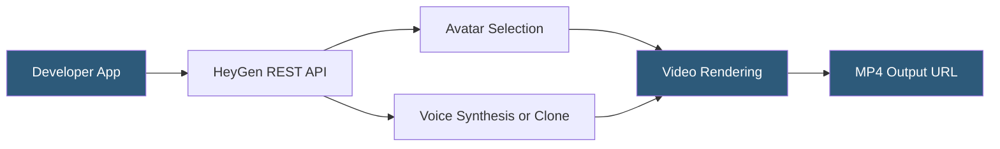

**Category:** Multimodal AI Platforms
**Difficulty:** Intermediate
**Reading time:** 5 min read

---

HeyGen is an AI video generation platform focused on avatar-based video creation with a strong API for developers. It offers photorealistic avatars, voice cloning, video translation with lip-sync, and interactive streaming avatars. HeyGen's video translation feature — which re-dubs existing videos in different languages while maintaining the original speaker's lip movements — has made it particularly popular for multilingual content strategies.

- **Avatar** — a photorealistic digital presenter used in HeyGen videos
- **Voice clone** — a custom TTS voice trained on a sample recording of the user's voice
- **Video translation** — automatic re-dubbing of a source video into another language with lip-sync adjustment
- **Streaming Avatar** — a real-time interactive avatar accessible via WebSocket for conversational AI
- **Interactive Avatar API** — HeyGen's SDK for embedding live-streaming avatars in web applications
- **Scene** — a segment in a HeyGen video combining avatar, background, and text content
- **Template** — a pre-built video layout for rapid video production

HeyGen's REST API (`POST /v2/video/generate`) accepts a JSON body specifying a list of video clips, each containing an avatar ID, a voice ID (or a voice_settings object with text and language for TTS), optional background configuration, and caption settings. Multiple clips chain sequentially into a final video. The request returns a video ID; clients poll the status endpoint until generation completes and retrieve the download URL.

Voice cloning creates a custom TTS voice from a 1–5 minute audio sample uploaded by the developer. The cloned voice is then used in generated videos by referencing the custom voice ID — enabling brand representatives to produce video content without recording new audio for every script change. Voice clones support multiple languages, allowing the same cloned voice to narrate in Spanish, French, or Japanese.

Video translation is submitted via `POST /v2/video_translate`. The API accepts a source video URL (an existing video of a person speaking) and target language specification. HeyGen automatically transcribes the speech, translates it, synthesizes speech in the target language, and adjusts the lip movements of the speaker in the video to match the new audio using its video synthesis model. The result is a dubbed video where the speaker appears to naturally speak the target language.

The Interactive Avatar feature uses a WebSocket-based streaming API: the developer embeds the HeyGen JavaScript SDK, connects to a streaming session, and sends text or audio; the avatar responds in real time with synchronized video, enabling embodied AI assistants, interactive product demos, and virtual event hosts.

- Producing multilingual video content libraries with automated video translation
- Building branded video generation pipelines using custom voice clones
- Creating interactive AI sales representatives or customer support agents
- Generating personalized onboarding videos at scale for SaaS products
- Publishing training content in multiple languages from a single recorded source

| Advantage | Disadvantage |
|-----------|--------------|
| Video translation with lip-sync is a unique differentiator | Realistic avatars raise deepfake ethical concerns requiring consent verification |
| Voice cloning enables consistent brand voice across content | Per-video pricing escalates at high content volume |
| Interactive streaming avatar for real-time applications | Source video quality for translation must be high quality |
| Strong multi-language TTS and voice clone support | Avatar selection on lower tiers limited to stock avatars |

- [Synthesia Video Generation API](synthesia-video-generation-api.md)
- [D-ID Video Synthesis](d-id-video-synthesis.md)
- [Fliki Text-to-Video](fliki-text-to-video.md)

---
*Part of the [Multimodal AI Platforms](index.md) category · [Back to Master Index](../../index.md)*
