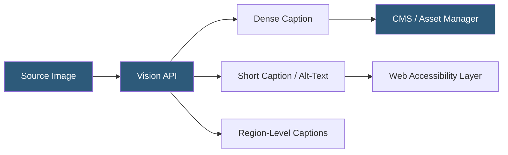

**Category:** Multimodal AI Platforms
**Difficulty:** Beginner
**Reading time:** 5 min read

---

Image captioning services automatically generate natural language descriptions of image content using vision-language models. They power accessibility alt-text generation, media asset management tagging, social media automation, and content moderation workflows. Modern captioning services range from managed APIs (Azure Vision, Google Cloud Vision) to open-source VLM-based approaches using LLaVA or BLIP-2.

- **Dense caption** — a detailed description of all visual elements in an image
- **Short caption** — a concise one-sentence description suitable for alt-text
- **Azure Dense Captioning** — Azure AI Vision feature generating captions for individual image regions
- **GCP Vision API** — Google Cloud's image analysis service with label and description generation
- **Alt-text** — short image description for screen readers and web accessibility compliance
- **WCAG 2.1** — web accessibility guidelines requiring meaningful alt-text for informative images
- **Structured caption** — a caption formatted with specific attributes (e.g., objects, scene, colors, mood)

Image captioning APIs accept an image (URL or base64) and return descriptive text generated by a vision-language model. The complexity and style of captions vary by service and configuration:

Azure AI Vision's "Describe" feature returns a structured JSON object with caption candidates ranked by confidence. Its Dense Captioning feature generates individual captions for multiple bounding box regions within an image, producing descriptions of each identified object or scene element. This is useful for detailed alt-text generation for complex images.

Google Cloud Vision API's `LABEL_DETECTION` and `OBJECT_LOCALIZATION` features identify objects and scenes with confidence scores. The `IMAGE_PROPERTIES` feature extracts dominant colors. For natural language descriptions, the Vertex AI image-to-text capability (based on Imagen or multimodal Gemini) produces richer sentence-form descriptions.

General-purpose VLMs (GPT-4V, Claude 3, Gemini 1.5) can be prompted with specific captioning instructions: "Write a 1-sentence alt-text description suitable for accessibility. Focus on the main subject and important visual information. Do not start with 'An image of'." This approach allows customizing caption style, focus, and length beyond what fixed-format API endpoints support.

For accessibility automation, captioning pipelines integrate with CMS platforms (WordPress, Contentful, Drupal) via webhooks that trigger caption generation when new images are uploaded, automatically populating alt-text fields without manual editor input.

- Automatically generating WCAG-compliant alt-text for large image libraries
- Populating metadata fields in digital asset management systems
- Generating product image descriptions for search indexing and SEO
- Creating audio descriptions for video accessibility (audio description tracks)
- Tagging and organizing stock photo collections by content

| Advantage | Disadvantage |
|-----------|--------------|
| Fully automated — scales to millions of images | Generated captions may miss context important to the image purpose |
| Multiple service options from managed API to self-hosted | Accuracy varies for specialized domains (medical, engineering) |
| Supports accessibility compliance automation | Custom captioning style requires prompt engineering with VLMs |
| Region-level captions for detailed asset metadata | Managed API costs accumulate at high image volume |

- [Visual Question Answering (VQA)](visual-question-answering-vqa.md)
- [GPT-4 Vision (GPT-4V) API](gpt-4-vision-gpt-4v-api.md)
- [BLIP Model Hosting](blip-model-hosting.md)

---
*Part of the [Multimodal AI Platforms](index.md) category · [Back to Master Index](../../index.md)*
