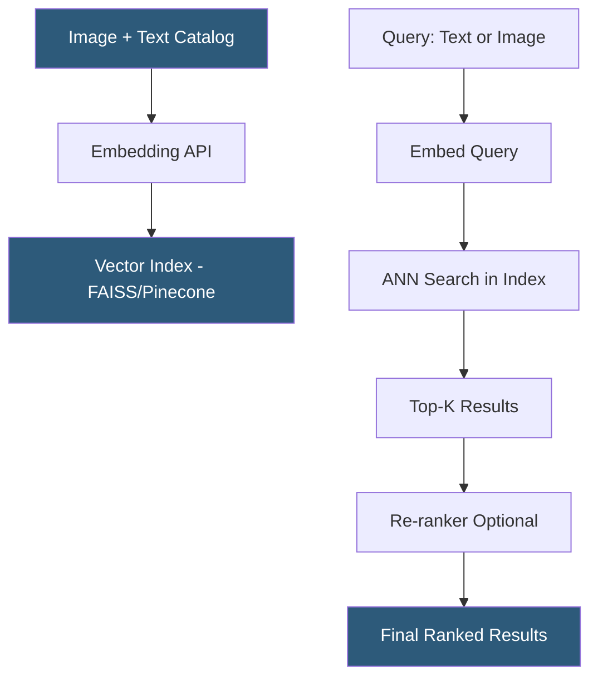

**Category:** Multimodal AI Platforms
**Difficulty:** Intermediate
**Reading time:** 5 min read

---

Image-text retrieval services enable finding images from text queries or finding relevant text descriptions from image inputs using vector similarity in a shared multimodal embedding space. These services power visual search in e-commerce, content discovery platforms, and knowledge management systems, and are foundational to multimodal RAG architectures where images serve as contextual knowledge for language model responses.

- **Text-to-image retrieval** — finding relevant images from a natural language query
- **Image-to-text retrieval** — finding relevant text documents or captions from an image query
- **ANN (Approximate Nearest Neighbor)** — fast similarity search algorithm used in vector indices
- **Recall@K** — evaluation metric measuring what fraction of relevant items appear in the top K results
- **Dense retrieval** — retrieval using learned dense embedding vectors (vs sparse keyword retrieval)
- **Weaviate multi-modal** — vector database with native image+text object support
- **FAISS** — Meta's open-source library for efficient similarity search at billion-vector scale

Image-text retrieval systems are built in two phases: offline indexing and online querying. During indexing, each catalog item (product image, document with images, media asset) is passed through a multimodal embedding model (CLIP, Vertex AI Multimodal Embeddings, VoyageAI multimodal) to produce a fixed-length vector. These vectors are stored in a vector database or a dedicated ANN index structure such as FAISS (flat, IVF, HNSW) or ScaNN.

At query time, the user's input — whether a text string ("red sports car under a sunset") or an image file — is encoded by the same embedding model into a query vector. The ANN index returns the K most similar indexed vectors, corresponding to the most semantically relevant catalog items. Because text and images share the same embedding space, a text query retrieves images and an image query can retrieve text documents or similar images.

Re-ranking adds a second pass using a more expensive cross-encoder model that jointly processes the query and each candidate result, refining the initial embedding-based ranking. Cross-encoders are slower than bi-encoder embedding retrieval but produce higher recall@K scores.

Managed services for image-text retrieval include Weaviate Cloud (supports multi-modal data objects with automatic vectorization via CLIP integration), Pinecone with multimodal embedding pipelines, and Azure AI Search with vision vectorizers. Self-hosted deployments use FAISS or Qdrant with a CLIP inference server.

- Visual product search in e-commerce accepting natural language or image queries
- Stock photo library search by text description or visual similarity
- News media archive search combining image and text content
- Scientific figure retrieval in literature review pipelines
- Content moderation by finding visually similar known-violation images

| Advantage | Disadvantage |
|-----------|--------------|
| Cross-modal queries without separate text/image search systems | ANN index accuracy trades off against query speed |
| Zero-shot retrieval generalizes to new visual concepts | CLIP-space alignment may miss fine-grained visual distinctions |
| Scales to billion-item catalogs with FAISS/HNSW | Embedding models require GPU for high-throughput indexing |
| Managed vector databases simplify operational overhead | Re-ranking adds latency for highest-accuracy use cases |

- [Multimodal Embeddings API](multimodal-embeddings-api.md)
- [CLIP Model API](clip-model-api.md)
- [Multimodal RAG Systems](multimodal-rag-systems.md)

---
*Part of the [Multimodal AI Platforms](index.md) category · [Back to Master Index](../../index.md)*
