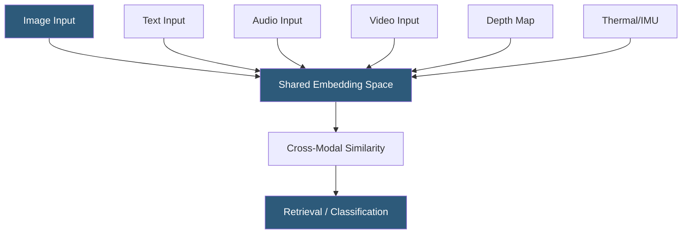

**Category:** Multimodal AI Platforms
**Difficulty:** Advanced
**Reading time:** 6 min read

---

ImageBind is Meta AI Research's multimodal model that learns joint embeddings across six modalities simultaneously: images, video, text, audio, depth maps, and thermal/IMU sensor data. By binding all modalities to a shared representation space, ImageBind enables cross-modal retrieval without paired training data for every modality combination — for example, retrieving images from audio queries without image-audio training pairs.

- **Six modalities** — images, video, text, audio, depth, thermal/IMU bound in a single embedding space
- **Joint embedding space** — a shared vector space where semantically aligned content from different modalities is co-located
- **Emergent cross-modal alignment** — alignment between modalities that were never trained together, enabled by transitivity through image binding
- **CLIP alignment** — ImageBind's image and text embeddings are compatible with CLIP's embedding space
- **Cross-modal retrieval** — finding relevant content in modality B given a query from modality A
- **Zero-shot composition** — combining embeddings from different modalities arithmetically for novel queries
- **Modality encoder** — specialized encoder (ViT for images, AST for audio) for each modality type

ImageBind's key insight is using images as the "binding" modality. During training, the model learns to align each non-image modality (audio, text, depth, thermal, IMU) to image embeddings, using large datasets of paired (modality, image) data. Because all modalities are independently aligned to images, they become transitively aligned to each other through the shared image space — audio-text alignment, for example, emerges without ever training on direct audio-text pairs.

Each modality has a dedicated encoder: images and video use Vision Transformers, audio uses an Audio Spectrogram Transformer (AST) that treats spectrograms as 2D patches, depth maps use a ViT on depth images, and IMU data is processed as 1D sequence. All encoders project to the same 1024-dimensional embedding space.

The practical capability of zero-shot cross-modal composition enables queries like "find images that look like they sound like ocean waves" — by computing the average of a text embedding ("ocean waves") and an audio embedding of wave sounds, the resulting combined vector queries the image index for visually and acoustically consistent matches. This arithmetic in embedding space is only possible because all modalities share the same coordinate system.

Hosting ImageBind requires approximately 4–8GB GPU memory. The model is available on Hugging Face and the Meta AI GitHub repository. FastAPI wrappers package the encoders as REST endpoints accepting base64-encoded media payloads, returning embedding vectors for downstream similarity computation.

- Building cross-modal search systems that find images from audio queries
- Detecting audio-visual inconsistencies in video content for moderation
- Creating sensor-fusion systems using depth and IMU alongside visual data
- Building accessibility applications that describe sounds to hearing-impaired users
- Research into emergent cross-modal alignment and multimodal representation learning

| Advantage | Disadvantage |
|-----------|--------------|
| Six modalities in a single model without modality-pair training | Model inference requires running six different encoders |
| Emergent cross-modal alignment without paired training data | Academic research origins — limited production deployment tooling |
| Arithmetic composition enables novel cross-modal query types | Embedding quality lower than specialized models for individual modalities |
| Open-source and self-hostable | Less developer tooling and SDK support than commercial alternatives |

- [CLIP Model API](clip-model-api.md)
- [Multimodal Embeddings API](multimodal-embeddings-api.md)
- [BLIP Model Hosting](blip-model-hosting.md)

---
*Part of the [Multimodal AI Platforms](index.md) category · [Back to Master Index](../../index.md)*
