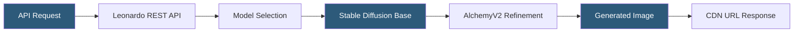

**Category:** Multimodal AI Platforms
**Difficulty:** Intermediate
**Reading time:** 5 min read

---

Leonardo.ai is a creative AI platform offering fine-tuned Stable Diffusion models optimized for specific aesthetics (game assets, photorealism, concept art) alongside a REST API for programmatic generation. It provides a model training pipeline for creating custom fine-tunes from uploaded datasets without ML expertise, making it popular with game developers, creative agencies, and indie studios that need stylistically consistent AI-generated assets.

- **Leonardo models** — proprietary fine-tuned checkpoints with specific aesthetic focuses
- **Custom model training** — dataset upload workflow for training LoRA/fine-tune on user images
- **AlchemyV2** — Leonardo's post-processing pipeline that enhances prompt adherence and detail
- **PhotoReal** — Leonardo's photorealism pipeline built on a custom diffusion architecture
- **Element** — a LoRA modifier that can be layered onto generations to adjust specific visual characteristics
- **Motion** — Leonardo's image-to-video feature generating short animated clips
- **API token** — the authentication key for programmatic API access

Leonardo.ai's REST API accepts generation requests at the `POST /generations` endpoint with parameters including the model ID, prompt, negative prompt, width, height, number of images (1–8), inference steps, guidance scale, and optional alchemy/photoreal flags. Authentication uses a Bearer token from the API settings in the Leonardo dashboard.

The platform hosts dozens of purpose-built models: "Leonardo Diffusion XL" for general high-quality outputs, "Leonardo Vision XL" for photorealistic renders, "Anime Pastel Dream" for illustrated styles, and game-focused checkpoints for pixel art, fantasy weapons, and character design. Game studios find Leonardo's pre-built game asset models more immediately usable than general-purpose SDXL or DALL-E.

Custom model training allows users to upload 10–20+ images of a subject, style, or object, which Leonardo fine-tunes into a personal model using LoRA. The resulting model can be used privately or published for the community. This provides stylistic consistency across generated assets — a game studio can train on their existing character art style and generate new assets matching their established aesthetic.

AlchemyV2 is a proprietary enhancement pipeline that runs after the primary generation, applying upscaling, sharpening, and prompt coherence improvements. PhotoReal is a separate high-fidelity mode using a custom architecture optimized for photorealistic portraits and environments. Both add additional API cost per generation.

- Generating consistent game assets (characters, environments, items) in a matching style
- Creating concept art at volume for game development ideation
- Building custom brand asset generators using fine-tuned style models
- Producing marketing imagery with photorealistic quality using PhotoReal mode
- Training domain-specific models for internal creative tool applications

| Advantage | Disadvantage |
|-----------|--------------|
| Game-focused model library ready out-of-the-box | Custom model training requires a learning curve and dataset curation |
| Custom model training without ML expertise | Less documentation and community tooling than raw Stable Diffusion |
| AlchemyV2 enhances output quality automatically | Rate limits vary significantly by subscription tier |
| Competitive pricing for high-volume generation | Proprietary platform — model portability is limited |

- [Stable Diffusion API Hosting](stable-diffusion-api-hosting.md)
- [Replicate Diffusion Models](replicate-diffusion-models.md)
- [Scenario.gg Game Asset Generation](scenario-gg-game-asset-generation.md)

---
*Part of the [Multimodal AI Platforms](index.md) category · [Back to Master Index](../../index.md)*
