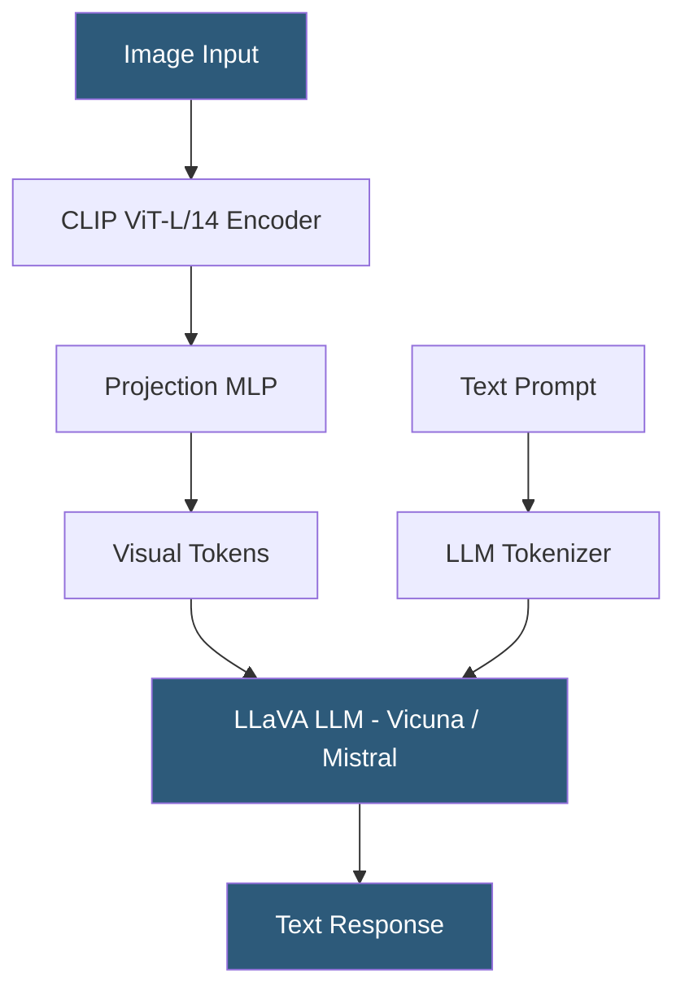

**Category:** Multimodal AI Platforms
**Difficulty:** Advanced
**Reading time:** 6 min read

---

LLaVA (Large Language and Vision Assistant) is an open-source vision-language model from Haotian Liu and colleagues that connects a visual encoder to a large language model using a trainable projection layer. LLaVA-1.5 and LLaVA-Next demonstrate that a lightweight architecture connecting CLIP ViT to Vicuna or Mistral can achieve near-GPT-4V performance on vision benchmarks, making it practical for self-hosted multimodal inference.

- **LLaVA architecture** — visual encoder + projection MLP + instruction-tuned LLM
- **Visual encoder** — CLIP ViT-L/14 used to extract image feature vectors
- **Projection layer** — a trainable MLP that maps visual features to the LLM token space
- **Instruction tuning** — fine-tuning on image-text instruction-following datasets (LLaVA-Instruct-150K)
- **LLaVA-1.5** — improved variant using LLaMA-2 or Vicuna-13B with MLP projection
- **LLaVA-Next** — further improvement supporting higher resolution images via dynamic patching
- **ollama / LM Studio** — local inference tools supporting LLaVA model deployment

LLaVA's architecture is intentionally simple: a frozen CLIP ViT encodes the input image into a sequence of patch feature vectors, which pass through a trainable projection MLP to produce a set of visual tokens in the language model's embedding dimension. These visual tokens are prepended to the text token sequence and fed into an instruction-tuned language model (Vicuna-7B/13B, LLaMA-2-7B/13B, Mistral-7B).

Only the projection MLP (and in later variants the LLM itself) is trained, using a two-stage procedure. In stage 1, only the MLP is trained on image-caption alignment data to teach it to translate visual features into language model space. In stage 2, the full model is fine-tuned on LLaVA-Instruct-150K — a dataset of image-text instruction pairs generated by GPT-4 and human annotators — teaching instruction-following behavior on visual inputs.

For self-hosted deployment, LLaVA runs efficiently on consumer hardware. LLaVA-1.5-7B runs in 10–14GB VRAM (RTX 3080/4070 capable), making local deployment feasible. Popular deployment paths include: Ollama (supports `llava` and `llava:13b` models directly via `ollama pull llava`), LM Studio (GUI interface with local API server), and the official LLaVA GitHub repository with FastAPI/Gradio demo server.

LLaVA-Next improves image resolution handling through dynamic high-resolution patching — dividing images into up to 6 tiles each processed at 336×336 pixels — producing significantly better OCR and fine-detail analysis compared to single low-resolution image processing.

- Self-hosting a vision-language model on in-house GPU hardware for data privacy
- Building document analysis and OCR pipelines without cloud API costs
- Running multimodal inference on edge devices with quantized 7B models
- Research and experimentation with vision-language architectures
- Building internal tools requiring image understanding without sending data to external APIs

| Advantage | Disadvantage |
|-----------|--------------|
| Open-source and fully self-hostable on consumer GPUs | Setup complexity compared to managed API services |
| No per-request API costs for on-premises deployment | Image understanding quality below GPT-4o on complex reasoning |
| LLaVA-Next supports high-resolution analysis | Model updates require manual weight updates |
| Integrates with Ollama/LM Studio for simple deployment | Multi-image input not natively supported in base LLaVA |

- [BLIP Model Hosting](blip-model-hosting.md)
- [Ollama Local Model Hosting](../open-source-model-hosting/ollama-local-model-hosting.md)
- [Visual Question Answering (VQA)](visual-question-answering-vqa.md)

---
*Part of the [Multimodal AI Platforms](index.md) category · [Back to Master Index](../../index.md)*
