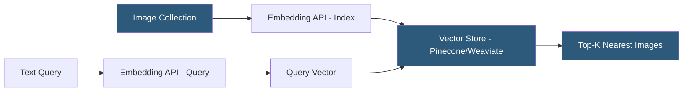

**Category:** Multimodal AI Platforms
**Difficulty:** Advanced
**Reading time:** 6 min read

---

Multimodal embeddings APIs produce vector representations that encode both images and text in a shared semantic space, enabling cross-modal similarity search and retrieval. These APIs are the foundation for building image search engines, visual recommendation systems, and multimodal RAG (Retrieval-Augmented Generation) pipelines where image context is retrieved by text queries or vice versa.

- **Multimodal embedding** — a vector that encodes the semantic meaning of an image, text, or both jointly
- **Shared embedding space** — a vector space where similar concepts in different modalities cluster together
- **Cross-modal retrieval** — finding images given a text query, or text given an image query
- **Embedding dimension** — vector size (commonly 512–1536 dimensions depending on model)
- **Similarity metric** — cosine similarity or dot product used to rank embedding relevance
- **Vertex AI Multimodal Embeddings** — Google's hosted API for image and text embeddings
- **VoyageAI multimodal** — commercial multimodal embedding API with strong retrieval benchmarks

Multimodal embeddings are generated by passing images or text (or both) through a model that outputs a fixed-length vector in a shared semantic space. The key property is that semantically related content — an image of a beach and the text "tropical vacation" — produces vectors that are geometrically close (high cosine similarity), while unrelated content produces distant vectors.

Google's Vertex AI Multimodal Embeddings API supports images (up to 20 MB), text (up to 32 characters short or up to 2048 characters long), and video (sampled frames) as inputs, returning a 1408-dimensional embedding vector. The API supports per-request configuration of output dimensions (128, 256, 512, 1408) trading precision for index size. Batch embedding requests process up to 25 inputs simultaneously for throughput efficiency.

OpenAI's CLIP-based embeddings (used internally by DALL-E) and Cohere's multimodal embed endpoint produce 512–1024 dimensional vectors. VoyageAI's `voyage-multimodal-3` model produces 1024-dimensional embeddings and ranks highly on multimodal retrieval benchmarks.

For production retrieval pipelines, multimodal embeddings are indexed in vector databases (Pinecone, Weaviate, Qdrant) with support for combined metadata filtering. A multimodal RAG system for product search might index a catalog of product images using the image embedding API, then at query time embed the user's natural language search query and retrieve the top-K matching product images based on cosine similarity.

- Building visual product search engines accepting natural language queries
- Implementing content-based image recommendation from browsing history
- Creating multimodal RAG pipelines retrieving relevant images for LLM context
- Detecting near-duplicate or visually similar images in large media collections
- Building cross-modal content tagging that matches images to text taxonomies

| Advantage | Disadvantage |
|-----------|--------------|
| Single vector space enables unified text-image search | Embedding quality varies significantly across model providers |
| Scales to billions of indexed items via vector databases | Coarse semantic alignment — fine-grained visual details may not encode well |
| Supports zero-shot retrieval without labeled training data | Managed API embedding costs accumulate for large catalog indexing |
| Enables multimodal RAG without per-task fine-tuning | Shared space may encode cultural or dataset biases |

- [CLIP Model API](clip-model-api.md)
- [Image-Text Retrieval Services](image-text-retrieval-services.md)
- [Multimodal RAG Systems](multimodal-rag-systems.md)

---
*Part of the [Multimodal AI Platforms](index.md) category · [Back to Master Index](../../index.md)*
