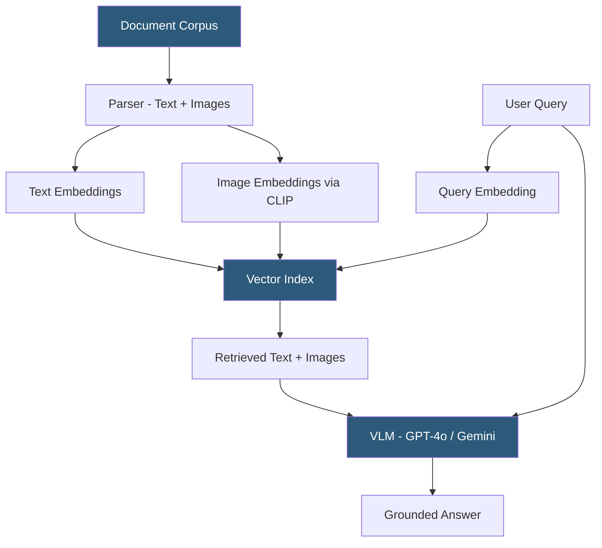

**Category:** Multimodal AI Platforms
**Difficulty:** Advanced
**Reading time:** 7 min read

---

Multimodal RAG (Retrieval-Augmented Generation) systems extend traditional text-only RAG to incorporate images, charts, diagrams, and other visual content as retrievable knowledge. They enable language models to answer questions grounded in both textual and visual information from a document corpus, addressing the limitation that traditional RAG discards visual content when processing PDFs and presentations.

- **Multimodal RAG** — retrieval-augmented generation that retrieves and uses both text and images as context
- **ColPali** — a recent approach using page-level vision model embeddings for document retrieval
- **Document parsing** — extracting text, tables, and images from PDFs and presentations for indexing
- **Image captioning for retrieval** — generating text descriptions of images to enable text-based retrieval
- **Late interaction** — ColBERT-style multi-vector matching for fine-grained document retrieval
- **Multimodal context injection** — inserting retrieved image content into VLM prompts as context
- **Chunk granularity** — the unit of content (page, paragraph, image, table) stored as a retrieval unit

Multimodal RAG extends the standard RAG pipeline by ensuring visual content is preserved and retrievable alongside text. The indexing pipeline begins with document parsing: PDFs are processed using tools like PyMuPDF, Unstructured.io, or LlamaParse to extract text paragraphs, tables, and embedded images separately. Each image (chart, diagram, photograph, screenshot) is either captioned using a VLM (to generate searchable text) or directly embedded using a multimodal embedding model (CLIP, Vertex AI embeddings) to produce a vector.

At retrieval time, the user query is embedded and compared against all indexed vectors — both text chunk vectors and image/caption vectors. The top-K retrieved items may include a mix of text paragraphs and images. These retrieved items are then assembled into the VLM prompt context: text chunks as standard text, and images as inline image content blocks (supported by GPT-4o, Claude 3, Gemini 1.5 Pro). The VLM generates its answer grounded in both the retrieved text and the retrieved visual evidence.

ColPali (a 2024 research approach) improves retrieval quality by using a PaliGemma vision-language model to embed full document page images rather than extracted text, capturing layout and visual structure information lost by text extraction. This significantly improves retrieval for chart-heavy reports and complex table layouts.

Key implementation frameworks include LlamaIndex (supports multimodal RAG with image indexing), Haystack (pipeline components for visual RAG), and LangChain with image embedding extensions. The choice of VLM for generation (GPT-4o, Claude 3, Gemini 1.5) determines the quality of visual reasoning over retrieved images.

- Answering questions about financial reports containing charts, tables, and text
- Building knowledge assistants over scientific literature with figures and equations
- Creating product support chatbots grounded in visual installation manuals
- Enabling search and Q&A over presentation slide decks preserving visual content
- Building compliance tools that reason over annotated regulatory documents with diagrams

| Advantage | Disadvantage |
|-----------|--------------|
| Preserves visual knowledge lost in text-only RAG pipelines | Significantly higher index complexity and storage vs text-only RAG |
| VLMs reason over retrieved images for visually grounded answers | Image retrieval recall lower than text retrieval for ambiguous queries |
| ColPali improves chart and layout-heavy document retrieval | VLM input token costs increase with image content in context |
| Works with standard vector databases with multimodal embedding APIs | Document parsing quality varies significantly by PDF complexity |

- [Multimodal Embeddings API](multimodal-embeddings-api.md)
- [GPT-4o Multimodal API](gpt-4o-multimodal-api.md)
- [Cross-Modal Search APIs](cross-modal-search-apis.md)

---
*Part of the [Multimodal AI Platforms](index.md) category · [Back to Master Index](../../index.md)*
