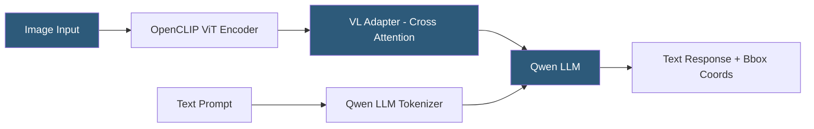

**Category:** Multimodal AI Platforms
**Difficulty:** Advanced
**Reading time:** 6 min read

---

Qwen-VL is Alibaba Cloud's family of open-source vision-language models that support image understanding, multi-image reasoning, and grounded text-image interaction. Qwen-VL-Max and Qwen-VL-Plus are available as hosted API endpoints through Alibaba Cloud's DashScope, while Qwen-VL-7B and Qwen-VL-Chat are open weights available on Hugging Face for self-hosted deployment, making the family relevant for both enterprise cloud integration and local research use.

- **Qwen-VL** — Alibaba's vision-language model family built on the Qwen (Tongyi Qianwen) LLM base
- **DashScope** — Alibaba Cloud's AI model service platform providing Qwen-VL API access
- **Visual encoder** — OpenCLIP ViT-bigG used as the image feature extractor
- **VL adapter** — cross-attention module bridging visual and language model components
- **Bounding box output** — Qwen-VL's ability to output localization coordinates for referenced objects
- **Multi-image reasoning** — processing multiple images in context for comparison and analysis tasks
- **Grounding** — associating text mentions with specific image regions via coordinate output

Qwen-VL is built on the Qwen-7B or Qwen-14B language model base with an added VL adapter — a cross-attention mechanism that integrates image features from an OpenCLIP ViT-bigG encoder into the language model's attention layers. The visual encoder processes images resized to 448×448 pixels (or higher resolution tiled variants), producing 256 image tokens per image that are inserted into the model's context.

A distinguishing feature is grounded output: Qwen-VL was trained with bounding box supervision, enabling the model to output spatial coordinates (`<ref>`) alongside text descriptions. When asked "where is the red car?", the model produces both a text description and bounding box coordinates in the image. This grounding capability enables applications requiring object localization without a separate detection model.

Multi-image reasoning is explicitly supported — the model processes multiple images in the same conversation turn, enabling tasks like "which of these two product images has better lighting?" or "compare the text in these three screenshots." The model maintains coherent references across images using image position tokens in the context.

For self-hosted deployment, Qwen-VL-7B-Chat runs on 16GB VRAM (A100, RTX 3090) using bfloat16, or in 8GB VRAM with 4-bit quantization. The `transformers` library supports the model natively. DashScope provides a managed API with the same interface pattern as Alibaba's other model APIs, using an API key for authentication.

- Document analysis requiring both content extraction and layout localization
- Comparing product images programmatically for e-commerce quality control
- Building grounded visual QA systems that explain visual reasoning spatially
- Multi-chart analysis in financial or scientific report processing pipelines
- Self-hosted vision-language inference in data-sensitive enterprise environments

| Advantage | Disadvantage |
|-----------|--------------|
| Bounding box grounding output unique among common VLMs | Training data primarily Chinese and English — other languages less capable |
| Multi-image reasoning in a single model call | Alibaba ecosystem dependency for DashScope API path |
| Open weights available for self-hosting | VL adapter cross-attention adds inference overhead vs direct integration |
| DashScope API for managed hosting in Alibaba Cloud | Less Western developer community support than GPT-4V or Claude |

- [LLaVA Multimodal Deployment](llava-multimodal-deployment.md)
- [CogVLM Deployment](cogvlm-deployment.md)
- [Visual Question Answering (VQA)](visual-question-answering-vqa.md)

---
*Part of the [Multimodal AI Platforms](index.md) category · [Back to Master Index](../../index.md)*
