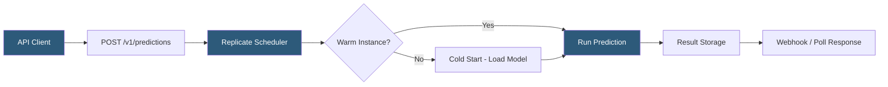

**Category:** Multimodal AI Platforms
**Difficulty:** Intermediate
**Reading time:** 6 min read

---

Replicate is a cloud platform for running machine learning models — including hundreds of Stable Diffusion variants, LoRA fine-tunes, video generation models, and other multimodal models — via a simple HTTP API. It eliminates GPU provisioning by exposing community-contributed and official models as serverless prediction endpoints, billing per-second of compute time.

- **Model** — a versioned ML model hosted on Replicate with a specific Docker image and weights
- **Prediction** — a single inference request run against a Replicate model
- **Version** — an immutable snapshot of a model's code, weights, and schema
- **Cog** — Replicate's open-source tool for packaging ML models as containers
- **Cold start** — latency incurred when a model is loaded from storage onto a fresh GPU
- **Deployment** — a dedicated, always-warm Replicate endpoint for low-latency production use
- **Webhook** — async result delivery mechanism for long-running generation tasks

Replicate's API accepts prediction requests at `POST https://api.replicate.com/v1/predictions` with a JSON body specifying the model version ID and input parameters. Inputs are model-specific and defined by the model author's schema — for a Stable Diffusion model, inputs include `prompt`, `negative_prompt`, `num_inference_steps`, `guidance_scale`, `width`, and `height`. The API immediately returns a prediction object with status `starting`, and the caller polls the prediction URL or receives the result via webhook when generation completes.

Replicate's infrastructure handles containerized model execution on GPU instances (A40, A100, H100 depending on the model). Many models cold-start in 5–30 seconds when first invoked, during which the model weights are loaded from storage to GPU memory. Subsequent requests to recently used models often benefit from warm instances. For production applications requiring consistent sub-second start times, Replicate Deployments allocate dedicated always-warm replicas, billed as reserved capacity.

The platform hosts thousands of community models covering Stable Diffusion 1.5, SDXL, SD3, custom LoRA fine-tunes, ControlNet variants, video generation (Stable Video Diffusion, AnimateDiff), image restoration (Real-ESRGAN, CodeFormer), speech synthesis, and language models. All models are versioned by a content-addressed hash of the container image, ensuring reproducibility.

Developers can push their own models using Cog, Replicate's open-source model packaging tool that wraps arbitrary Python ML code with a Pydantic input/output schema into a Docker container deployable to Replicate with `cog push`.

- Accessing hundreds of Stable Diffusion fine-tunes without self-hosting GPU infrastructure
- Running specialized ControlNet pipelines (depth, pose, canny) on demand
- Prototyping video generation workflows using AnimateDiff or Stable Video Diffusion
- Building image upscaling pipelines with Real-ESRGAN in a serverless architecture
- Hosting custom fine-tuned models for brand-specific image generation

| Advantage | Disadvantage |
|-----------|--------------|
| Thousands of community models available instantly | Cold start latency (5–30s) unsuitable for real-time use without Deployments |
| Per-second billing — no idle infrastructure cost | Unpredictable pricing for high-volume pipelines |
| Simple REST API with webhook result delivery | Model outputs expire from hosted URLs after 1 hour |
| Cog enables custom model publishing | Less control than self-hosted for custom inference optimization |

- [Stable Diffusion API Hosting](stable-diffusion-api-hosting.md)
- [Stability.ai API](stability-ai-api.md)
- [RunwayML Gen-2 API](runwayml-gen-2-api.md)

---
*Part of the [Multimodal AI Platforms](index.md) category · [Back to Master Index](../../index.md)*
