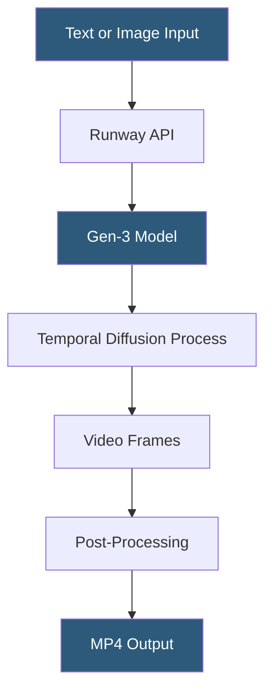

**Category:** Multimodal AI Platforms
**Difficulty:** Intermediate
**Reading time:** 5 min read

---

Runway is a creative AI company offering a suite of video generation and editing tools, with Gen-3 Alpha representing their most advanced model for high-fidelity, temporally consistent video generation. The platform combines video generation, AI video editing, background removal, motion tracking, and color grading in a unified interface and API, serving professional filmmakers alongside developers building automated video pipelines.

- **Gen-3 Alpha** — Runway's current flagship model for high-quality, consistent video generation
- **Temporal consistency** — maintaining visual coherence across video frames without flickering
- **Act One** — Runway's performance capture feature driving avatar expressions from webcam input
- **Multi Motion Brush** — tool for controlling motion direction of specific image regions independently
- **Video-to-video** — using a source video clip to guide the style or content of generated output
- **Extend** — feature for extending a generated video clip beyond its original duration
- **Director Mode** — interface for specifying camera angles and movements cinematically

Runway's Gen-3 Alpha model represents a significant architectural advance over Gen-2 in temporal consistency — the ability to maintain visual coherence of characters, objects, and environments across the video's frame sequence without the flickering and morphing artifacts common in earlier diffusion-based video models. This makes Gen-3 outputs suitable for professional creative work where frame-to-frame coherence is critical.

The model is accessible through Runway's web application and through the Runway API (access granted to API partners). Generation inputs include a text prompt or an image, with optional parameters for duration (5 or 10 seconds), camera motion presets (zoom in, pan right, tracking shot), and a seed value. Gen-3's understanding of cinematic language allows prompts like "a slow dolly push toward a campfire in a dense forest, shallow depth of field, golden hour" to produce cinematically coherent results.

Multi Motion Brush addresses a limitation of uniform motion: by painting directional vectors onto specific image regions, creators can direct the sky to move right (clouds drifting), the foreground to stay still, and a character to move forward — all independently. This requires the web interface rather than the API, as it involves interactive input.

The Act One feature maps facial expressions and head movements from a webcam video to an AI-generated avatar in real time, enabling content creators to animate characters using their own performances without motion capture equipment.

- Producing high-quality concept trailer sequences for film and game pre-production
- Generating social media video content at scale from product images
- Building automated video personalization pipelines for marketing outreach
- Creating educational explainer animations from illustrated diagrams
- Animating still photography for feature films and documentary content

| Advantage | Disadvantage |
|-----------|--------------|
| Gen-3 temporal consistency suitable for professional use | API access restricted to approved partners |
| Rich in-app tools beyond API (Director Mode, Act One) | Per-credit pricing is expensive for high-volume production |
| Strong cinematic prompt understanding | 5–10 second clips require chaining for longer narratives |
| Extend feature enables sequential scene building | Web app features not fully exposed via API |

- [RunwayML Gen-2 API](runwayml-gen-2-api.md)
- [Pika Labs Video API](pika-labs-video-api.md)
- [Synthesia Video Generation API](synthesia-video-generation-api.md)

---
*Part of the [Multimodal AI Platforms](index.md) category · [Back to Master Index](../../index.md)*
