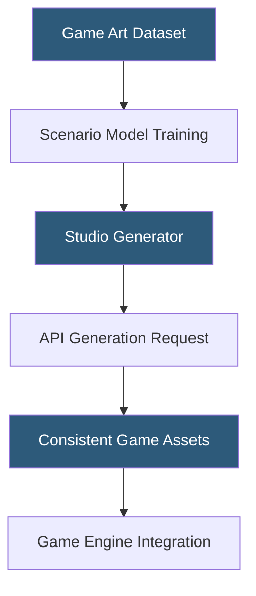

**Category:** Multimodal AI Platforms
**Difficulty:** Intermediate
**Reading time:** 5 min read

---

Scenario.gg is a specialized AI platform for video game asset creation, offering model training on game-specific art styles and a REST API for generating consistent sprites, characters, environments, and items. It enables game studios to train on their existing art assets and generate new content matching their game's visual identity at scale, without requiring general-purpose prompt engineering expertise.

- **Style-trained model** — a custom fine-tune trained on a studio's existing art assets
- **Asset consistency** — generating new content that visually matches trained style references
- **Generator** — Scenario's term for a trained model ready to produce new images
- **Composition** — a Scenario pipeline combining multiple generators or inpainting steps
- **IP Adapter** — technique for applying a reference image's visual identity to generated outputs
- **Modalities** — Scenario supports sprites, environments, portraits, items, and UI elements
- **Batch generation** — producing multiple image variants from a single API call for asset selection

Scenario.gg's workflow begins with model training: a studio uploads a dataset of their existing game art (sprites, concept art, environment tiles) and Scenario fine-tunes a Stable Diffusion-based model on these assets. The training process typically requires 15–50 images of consistent style and completes within 30–60 minutes. The resulting generator is stored in the studio's Scenario workspace and accessible via API.

The REST API at `POST /api/generators/{generator_id}/inferences` accepts a text prompt, number of images (up to 8), inference steps, guidance scale, and optional seed for reproducibility. The fine-tuned generator produces images in the trained art style without requiring style keywords in the prompt — the model inherently applies the learned aesthetic to all outputs. For example, a studio with a pixel art RPG can train on their existing sprites and generate new enemy types, weapons, and items that automatically match the game's visual language.

Inpainting capabilities allow extending or editing existing assets within the trained style — adding decorations to a room environment, adjusting a character's outfit — while preserving the source image outside the mask region. The IP Adapter integration allows character consistency: an uploaded character portrait is used as a visual identity reference, and the model generates new poses or environments maintaining the character's appearance.

Compositions chain multiple generation steps, enabling pipelines like "generate base character → inpaint clothing details → upscale to 2x resolution" within a single API workflow.

- Generating new NPC characters, enemies, and items matching an existing game's art style
- Creating environment and background variations for level design content packs
- Rapidly prototyping asset concepts during game design ideation phases
- Building internal tools allowing non-technical designers to generate style-consistent assets
- Producing localized or variant versions of existing assets for DLC content

| Advantage | Disadvantage |
|-----------|--------------|
| Style-trained models eliminate prompt engineering burden | Training data preparation requires curation effort |
| Asset consistency critical for game visual identity | Platform limited to visual game assets — no audio or 3D |
| IP Adapter maintains character identity across generations | Per-inference pricing adds up for large asset libraries |
| Compositions enable multi-step automated pipelines | Model quality depends heavily on training dataset quality |

- [Leonardo.ai API](leonardo-ai-api.md)
- [Stable Diffusion API Hosting](stable-diffusion-api-hosting.md)
- [Replicate Diffusion Models](replicate-diffusion-models.md)

---
*Part of the [Multimodal AI Platforms](index.md) category · [Back to Master Index](../../index.md)*
