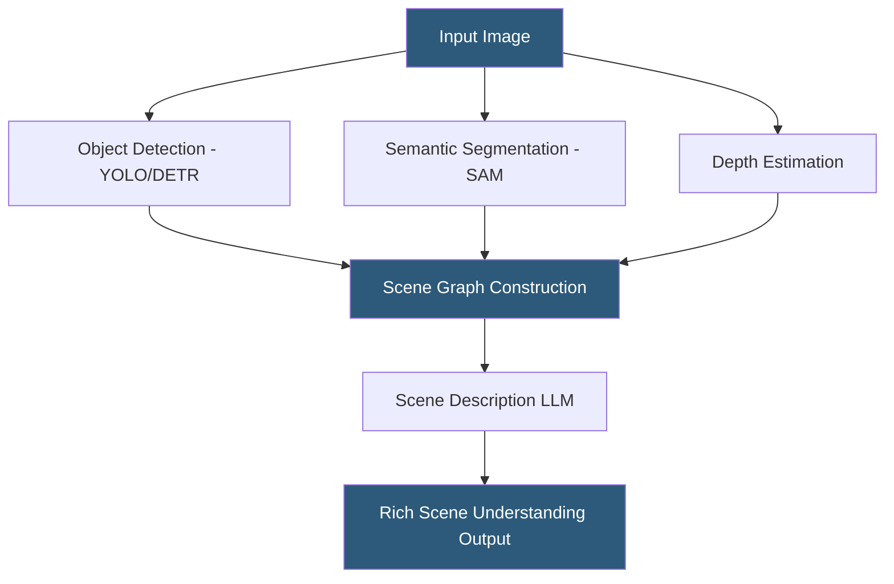

**Category:** Multimodal AI Platforms
**Difficulty:** Advanced
**Reading time:** 6 min read

---

Scene understanding platforms analyze images and video to generate holistic interpretations of scenes: identifying all objects, their spatial relationships, scene context (indoor/outdoor, time of day, setting type), and interactions between entities. These platforms go beyond object detection to produce rich semantic descriptions used in autonomous systems, robotics, augmented reality, and AI-powered content intelligence.

- **Semantic segmentation** — classifying every pixel in an image into a semantic category
- **Instance segmentation** — distinguishing individual instances of the same object class
- **Panoptic segmentation** — unified segmentation combining semantic and instance segmentation
- **Depth estimation** — predicting the relative or absolute distance of objects from the camera
- **Scene graph** — a structured representation of objects and their pairwise relationships in a scene
- **Contextual scene classification** — identifying the high-level setting (kitchen, office, highway)
- **SAM (Segment Anything Model)** — Meta's general-purpose segmentation model for arbitrary objects

Scene understanding pipelines combine multiple specialized models. Object detection models (YOLO, DETR, Faster R-CNN) identify bounding boxes and class labels for all objects. Segmentation models (SAM, Mask2Former) partition the image at the pixel level into semantic regions. Depth estimation models (MiDaS, DepthPro) predict per-pixel depth values for 3D spatial reasoning.

Meta's Segment Anything Model (SAM) represents a significant advance in general-purpose segmentation: trained on 1 billion masks, SAM accepts point, box, or text prompts to generate high-quality segmentation masks for arbitrary objects without category-specific fine-tuning. SAM 2 extends this to video with consistent object tracking across frames. SAM is available as an API via Hugging Face inference endpoints and Replicate.

Scene graphs encode relationships between detected objects as (subject, predicate, object) triplets: ("person", "sitting on", "chair"), ("cup", "on top of", "table"). Visual relationship detection models (Neural Motifs, UBB) extract these graphs, enabling structured spatial reasoning. Scene graphs power visual question answering systems and robotics planning.

For managed scene understanding, Azure AI Vision's spatial analysis and scene description features, Google Cloud Vision's object localization and scene classification, and AWS Rekognition's scene detection provide commercial API access without running specialized models. For research-grade or custom analysis, the combination of SAM + DINO (for detection) + MiDaS (for depth) + a VLM (for semantic description) covers the full scene understanding pipeline.

- Autonomous vehicle perception requiring full scene semantic understanding
- Retail analytics identifying product placement and shopper interactions
- Security camera analysis detecting specific object configurations or activities
- AR/VR scene understanding for digital-physical object interaction
- Accessibility tools generating comprehensive scene descriptions for navigation

| Advantage | Disadvantage |
|-----------|--------------|
| SAM's general-purpose segmentation eliminates class-specific training | Multi-model pipeline adds latency and infrastructure complexity |
| Panoptic segmentation provides complete pixel-level scene description | Scene graph extraction models are less mature for open-world scenes |
| Depth estimation enables 3D spatial reasoning from 2D images | Highly accurate scene understanding requires GPU-intensive models |
| Managed APIs cover common scene analysis tasks without ML expertise | Complex scenes with many objects degrade detection performance |

- [Video Understanding APIs](video-understanding-apis.md)
- [Visual Question Answering (VQA)](visual-question-answering-vqa.md)
- [Cross-Modal Search APIs](cross-modal-search-apis.md)

---
*Part of the [Multimodal AI Platforms](index.md) category · [Back to Master Index](../../index.md)*
