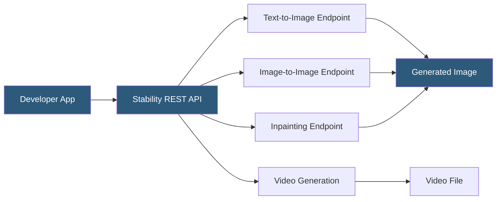

**Category:** Multimodal AI Platforms
**Difficulty:** Intermediate
**Reading time:** 6 min read

---

Stability.ai operates the REST API platform for its Stable Diffusion family of models, offering text-to-image, image-to-image, inpainting, upscaling, and video generation endpoints under a managed SaaS model. The Stability AI API eliminates self-hosted GPU management while still providing access to Stability's latest models including SD3, SDXL, and Stable Video Diffusion through a simple credit-based billing system.

- **Stable Diffusion XL (SDXL)** — Stability's high-resolution 1024×1024 native output model
- **SD3 / SD3 Medium** — Stability's third-generation model with improved text rendering
- **Stable Video Diffusion (SVD)** — image-to-video generation model producing short clips
- **Stable Image Core** — Stability's fastest, most cost-effective generation endpoint
- **Credit system** — Stability API billing unit; each generation consumes a fixed credit amount
- **Aspect ratio parameter** — native aspect ratio selection replacing manual width/height dimensions
- **Image-to-image strength** — noise level controlling how much the output deviates from the input image

The Stability AI API uses a REST architecture with API key authentication via the `Authorization: Bearer` header. Each endpoint accepts a multipart form or JSON body containing the model parameters and returns the generated image directly as binary data in the response body, or as a base64-encoded JSON field depending on the `accept` header provided.

The core text-to-image endpoint accepts a prompt, optional negative prompt, aspect ratio (e.g., `16:9`, `1:1`, `9:16`), output format (`jpeg`, `png`, `webp`), seed (for reproducibility), and model selection. Unlike raw Stable Diffusion parameters, the API abstracts away sampling steps and CFG scale — Stability's backend optimizes these internally for each model, simplifying the developer experience at the cost of fine-grained control.

For image editing, the image-to-image endpoint accepts an uploaded source image and a strength parameter (0–1) controlling how strongly the source image constrains the output. Inpainting replaces masked regions using text description while preserving surrounding pixels. The sketch-to-image endpoint converts rough drawings into photorealistic images, using the uploaded sketch as structural guidance via ControlNet internally.

Stable Video Diffusion endpoints generate 2–5 second video clips from a single input image. The model animates the scene with natural motion (camera movement, object dynamics) producing MP4 files. Generation typically takes 30–90 seconds depending on resolution and model variant.

- Building image generation features without managing GPU infrastructure
- Generating product lifestyle images and variations for e-commerce
- Creating animated product previews from static imagery using SVD
- Prototyping AI-generated art features before committing to self-hosted deployment
- Producing large volumes of synthetic training images for computer vision models

| Advantage | Disadvantage |
|-----------|--------------|
| No GPU infrastructure management required | Credit-based billing less predictable than subscription at scale |
| Access to latest Stability models without self-hosting | Less control than self-hosted (steps, samplers, LoRA not exposed) |
| Simple aspect ratio parameters hide complex resolution logic | API rate limits constrain burst generation workloads |
| Video generation without specialized hardware | Generated images expire from hosted URLs; must download immediately |

- [Stable Diffusion API Hosting](stable-diffusion-api-hosting.md)
- [DALL-E 3 API](dall-e-3-api.md)
- [Replicate Diffusion Models](replicate-diffusion-models.md)

---
*Part of the [Multimodal AI Platforms](index.md) category · [Back to Master Index](../../index.md)*
