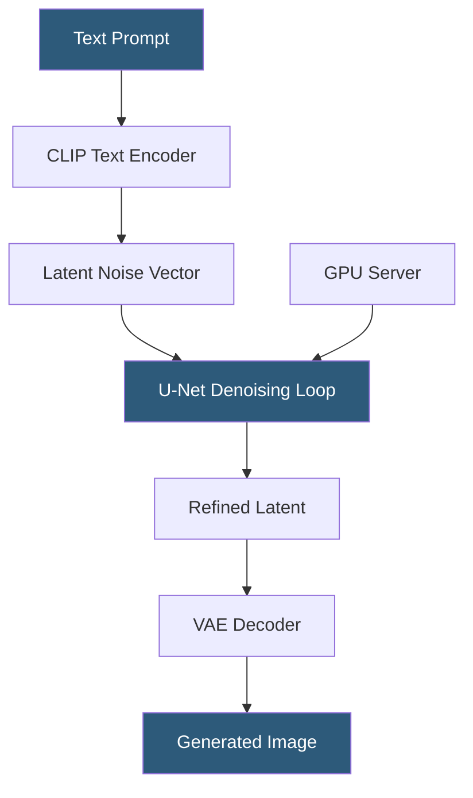

**Category:** Multimodal AI Platforms
**Difficulty:** Advanced
**Reading time:** 7 min read

---

Stable Diffusion is an open-source latent diffusion model for text-to-image generation that can be self-hosted on GPU infrastructure, offering full control over model weights, fine-tuning, and inference parameters. Hosting Stable Diffusion as an API involves serving model inference through frameworks like Diffusers, ComfyUI, or A1111 WebUI behind an HTTP API layer, enabling custom pipelines that commercial APIs cannot accommodate.

- **Latent diffusion model (LDM)** — generates images by denoising in a compressed latent space
- **CLIP text encoder** — encodes text prompts into embedding vectors guiding the diffusion process
- **VAE (Variational Autoencoder)** — encodes/decodes between pixel space and latent space
- **Sampling steps** — number of denoising iterations (15–50 typically); more steps improve quality
- **CFG scale** — Classifier-Free Guidance scale controlling prompt adherence vs. diversity
- **LoRA (Low-Rank Adaptation)** — lightweight fine-tuning technique for customizing SD models
- **ComfyUI** — node-based SD interface with a REST API for pipeline automation

Stable Diffusion's inference pipeline begins by encoding the text prompt into a conditioning vector using a CLIP text encoder. A random noise vector is sampled in the latent space (typically 64×64 for a 512×512 output image), and the U-Net denoising network iteratively refines this vector over the specified number of sampling steps, guided by the text conditioning via cross-attention layers.

The Classifier-Free Guidance (CFG) mechanism runs two forward passes per step — one conditioned on the text prompt and one unconditioned — and interpolates between them. Higher CFG values (7–12) produce images that adhere more closely to the prompt; lower values introduce more diversity and randomness. After denoising completes, the VAE decoder upsamples the latent to full pixel resolution.

Self-hosting typically uses the Hugging Face `diffusers` library (Python), which provides a clean programmatic API for building SD pipelines with support for LoRA, ControlNet, inpainting, img2img, and multiple samplers. For web-accessible API hosting, A1111 (AUTOMATIC1111 WebUI) exposes an HTTP API at `/sdapi/v1/txt2img`, and ComfyUI provides a WebSocket + REST API for node-graph pipelines. Both can be containerized and fronted with a reverse proxy.

Hardware requirements are significant: SD 1.5 requires ~4 GB VRAM (can run on consumer GPUs), SD XL requires ~10–16 GB VRAM, and SD 3 requires ~18 GB+ VRAM. Multi-GPU setups and model quantization with bfloat16 reduce memory requirements. Inference throughput scales directly with GPU count for parallel request handling.

- Building a custom image generation API with proprietary fine-tuned model weights
- Running LoRA-customized models for brand-consistent image generation
- Hosting generation pipelines for sensitive use cases where data cannot leave your infrastructure
- Creating high-volume, cost-optimized generation at scale compared to commercial API pricing
- Experimenting with ControlNet, inpainting, and advanced pipelines not available via SaaS APIs

| Advantage | Disadvantage |
|-----------|--------------|
| Full control over model weights and fine-tuning | Significant GPU infrastructure operational burden |
| No per-image API pricing — fixed hardware cost | Complex setup and maintenance vs. managed APIs |
| Supports advanced pipelines (ControlNet, LoRA) | Requires expertise to optimize throughput and memory |
| Data never leaves your infrastructure | Scaling to handle request bursts requires custom autoscaling |

- [Stability.ai API](stability-ai-api.md)
- [Replicate Diffusion Models](replicate-diffusion-models.md)
- [DALL-E 3 API](dall-e-3-api.md)

---
*Part of the [Multimodal AI Platforms](index.md) category · [Back to Master Index](../../index.md)*
