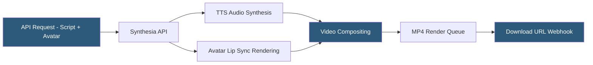

**Category:** Multimodal AI Platforms
**Difficulty:** Intermediate
**Reading time:** 6 min read

---

Synthesia is an AI video creation platform specializing in avatar-based video generation — producing talking-head videos from text scripts using photorealistic AI avatars without cameras, actors, or studios. The Synthesia API enables programmatic video creation for use cases like localized training content, personalized sales videos, and automated explainer production across 130+ languages.

- **AI avatar** — a photorealistic virtual presenter that lip-syncs to synthesized speech
- **Text-to-speech (TTS)** — Synthesia's integrated speech synthesis in 130+ languages and voices
- **Custom avatar** — a personalized avatar trained on consented video footage of a real person
- **Template** — a video layout defining avatar placement, background, text overlays, and branding
- **Scene** — a single video segment containing one avatar speaking one piece of text
- **Video export** — final MP4 file rendered and delivered at up to 1080p
- **Brand kit** — custom fonts, colors, and logos applied consistently across Synthesia videos

The Synthesia API accepts a POST request to `/v1/videos` with a JSON body containing the video title, template ID (optional), and a scenes array. Each scene object specifies the avatar ID, the text script for that scene, the language, optional background image or video, and any overlaid text or branding elements. The API immediately returns a video ID and a status of `in_progress`.

Internally, Synthesia processes each scene by first synthesizing the speech audio using the selected language and voice from its TTS engine (built on neural TTS providers), then running a lip-sync rendering pipeline that maps the speech phonemes to mouth movements and facial expressions on the selected avatar. The avatar video frames are composited with the background, text overlays, and screen recordings in post-processing.

Custom avatars are created through a separate consent and training workflow: the human subject records a 30–40 minute video dataset following Synthesia's recording guidelines, consents explicitly via a biometric verification process, and Synthesia trains an avatar model on this footage. Custom avatars are scoped to the customer's organization and enable branded spokesperson videos at scale.

Webhook callbacks deliver the completion status and download URL when rendering finishes (typically 2–5 minutes for a 2-minute video). Videos are available as MP4 files at up to 1080p resolution with selectable aspect ratios (16:9, 9:16, 1:1) for different distribution channels.

- Generating localized employee training videos in 130+ languages from a single script
- Creating personalized outbound sales videos with prospect-specific script insertion
- Automating product explainer video production for e-commerce catalog updates
- Building internal knowledge base video content without video production overhead
- Producing regular executive communications or announcements at scale

| Advantage | Disadvantage |
|-----------|--------------|
| 130+ language support with native TTS voices | Output quality is recognizably synthetic at close inspection |
| No cameras, studios, or professional talent required | Custom avatar training requires consented video recording sessions |
| Rapid iteration — script changes regenerate video in minutes | Cost per video minute is high compared to text/image generation |
| Programmatic personalization via API script variables | Not suitable for emotionally nuanced or highly dynamic presentations |

- [D-ID Video Synthesis](d-id-video-synthesis.md)
- [HeyGen Avatar API](heygen-avatar-api.md)
- [Runway Video Generation](runway-video-generation.md)

---
*Part of the [Multimodal AI Platforms](index.md) category · [Back to Master Index](../../index.md)*
