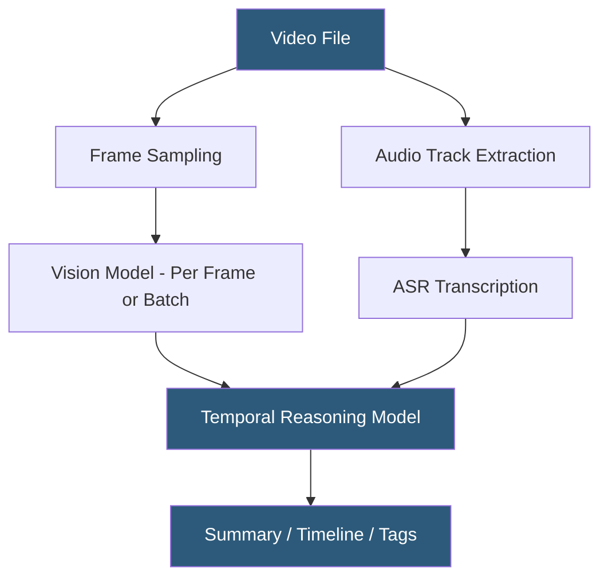

**Category:** Multimodal AI Platforms
**Difficulty:** Advanced
**Reading time:** 6 min read

---

Video understanding APIs analyze video content to extract semantic information: transcription, scene detection, object tracking, activity recognition, and natural language summarization. They power automated content moderation, media asset cataloging, sports analytics, and video search systems. Modern approaches use large multimodal models (Gemini 1.5 Pro, GPT-4o) capable of reasoning over entire video files, or specialized CV pipelines for high-throughput frame-level analysis.

- **Temporal understanding** — reasoning about events across the time dimension of a video
- **Scene detection** — identifying shot boundaries and scene transitions in video
- **Activity recognition** — classifying actions performed by subjects across video segments
- **Video captioning** — generating descriptive text summarizing video content
- **Keyframe extraction** — selecting representative frames from a video for downstream analysis
- **Video transcription** — converting spoken audio in video to text using ASR
- **Gemini 1.5 video understanding** — native video analysis in Gemini's 2M-token context window

Video understanding approaches fall into two architectures. The first — and historically dominant — approach samples frames at regular intervals (1–5 fps) or at detected scene changes, processes each frame or batch of frames with a vision model, and applies temporal aggregation to combine per-frame results into video-level understanding. This enables high-throughput processing at scale using established computer vision APIs (AWS Rekognition Video, Google Video Intelligence API, Azure Video Analyzer).

Google Video Intelligence API supports shot change detection, label detection (identifying objects and activities), text detection (OCR over video frames), explicit content detection, speech transcription, and object tracking. Each feature is requested individually, and processing is asynchronous — a video annotation job is submitted via REST API, and results are retrieved from Cloud Storage when processing completes.

The second approach — native long-context video processing — uses Gemini 1.5 Pro's ability to process full video files (up to 1 hour, ~100K tokens) in a single model call. This enables temporal reasoning that tracks story arcs, identifies callback references, and answers questions spanning the entire video without segment-by-segment fragmentation. Gemini processes videos at approximately 1 frame per second with audio, submitting via the File API before referencing in a prompt.

AWS Rekognition Video streams video through Kinesis Data Streams for real-time analysis (people detection, PPE compliance, unsafe content) or processes stored video files in S3 with a 48-hour analysis window for batch workflows.

- Moderating user-generated video content at scale for policy violations
- Automatically generating chapter markers and summaries for long-form educational videos
- Cataloging sports footage by event type, player, and game situation
- Extracting product appearances and brand mentions from broadcast media
- Building video search systems enabling natural language queries over video libraries

| Advantage | Disadvantage |
|-----------|--------------|
| Gemini 1.5 enables full-video temporal reasoning in one call | Native LLM-based video processing is costly at high volume |
| Specialized APIs (Rekognition, Video Intelligence) optimized for throughput | Frame sampling misses events between sampled frames |
| Real-time streaming analysis via Rekognition/Kinesis | Temporal understanding degrades for very long videos |
| Pre-built activity and object detection models | Custom activity recognition requires additional fine-tuning |

- [Gemini Multimodal API](gemini-multimodal-api.md)
- [Image Captioning Services](image-captioning-services.md)
- [Scene Understanding Platforms](scene-understanding-platforms.md)

---
*Part of the [Multimodal AI Platforms](index.md) category · [Back to Master Index](../../index.md)*
