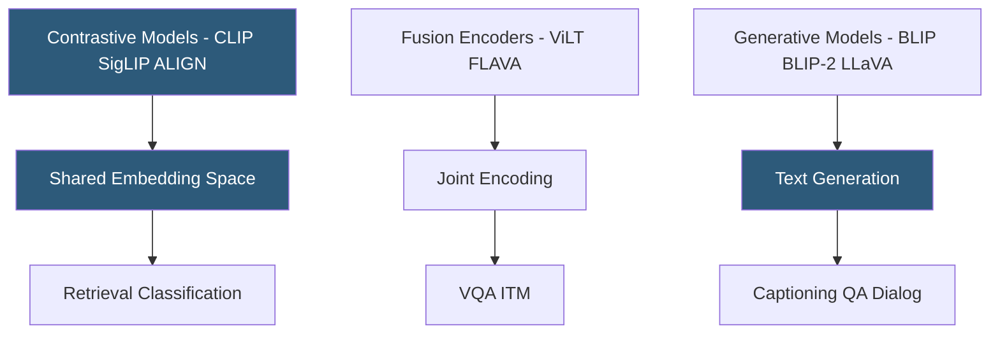

**Category:** Multimodal AI Platforms
**Difficulty:** Advanced
**Reading time:** 7 min read

---

Vision-language pretraining (VLP) models are trained jointly on image-text pairs to learn shared visual and linguistic representations. Models like ALIGN, Florence, and FLAVA establish the foundational representations that downstream tasks (VQA, captioning, retrieval, generation) fine-tune from. Understanding VLP architectures is essential for selecting the right base model for multimodal applications.

- **Dual encoder** — separate image and text encoders projecting to a shared embedding space (CLIP, ALIGN)
- **Fusion encoder** — a model with cross-modal attention layers enabling joint encoding of image-text pairs (ViLT, FLAVA)
- **Image-text contrastive learning** — maximizing similarity between matching pairs while minimizing it for non-matching pairs
- **Masked image modeling** — reconstructing masked image patches as a pretraining objective (BEiT, MAE)
- **Visual grounding** — pretraining on region-text alignment for object-phrase correspondence
- **Florence** — Microsoft's foundational vision model pretrained on large-scale image-text data
- **SigLIP** — Google's improved contrastive training objective using sigmoid loss for better embedding quality

Vision-language pretraining encompasses multiple training paradigms, each producing models suited to different downstream tasks.

**Contrastive pretraining** (CLIP, ALIGN, SigLIP) trains dual encoders on millions of (image, caption) pairs to maximize cosine similarity between matching pairs. The resulting models produce joint embedding spaces useful for retrieval and zero-shot classification but require decoder additions for generation tasks. SigLIP improves on CLIP by replacing the softmax loss with sigmoid loss applied independently to each pair, enabling better performance without requiring large batch sizes.

**Fusion encoder pretraining** (ViLT, FLAVA, VilBERT) processes image patches and text tokens through shared or jointly-attending transformer layers, producing a fused representation better suited for tasks requiring deep image-text interaction (VQA, image-text matching). ViLT is particularly notable for eliminating the separate heavy image feature extractor (no ResNet or ViT pre-processing), processing raw image patches directly alongside text tokens.

**Microsoft's Florence** model family uses a unified pretraining framework covering contrastive, generative, and grounding objectives simultaneously on a large-scale curated image-text corpus. Florence produces a powerful general-purpose visual backbone that transfers effectively to detection, segmentation, and understanding tasks with minimal fine-tuning.

**FLAVA** (Facebook's Foundational Language and Vision Alignment) addresses the limitation that contrastive models (like CLIP) perform poorly on generative tasks by adding masked image modeling, masked text modeling, and masked multimodal modeling objectives in addition to contrastive learning.

For practitioners, the key selection criterion is the downstream task: contrastive models excel at retrieval and classification; fusion encoders excel at VQA and grounding; generative models excel at captioning and dialog.

- Selecting the optimal pretrained visual backbone for fine-tuning on domain-specific VQA tasks
- Building retrieval systems using contrastive model embeddings (CLIP/SigLIP)
- Adapting Florence as a foundation for custom object detection and grounding applications
- Understanding why a production VLM underperforms on specific tasks by examining its pretraining architecture
- Designing multimodal research experiments requiring specific pretraining properties

| Advantage | Disadvantage |
|-----------|--------------|
| Pretrained foundations enable strong few-shot transfer | Pretraining at scale requires thousands of GPU hours — impractical to replicate |
| Contrastive models provide efficient retrieval without generation overhead | No single architecture excels at all multimodal tasks |
| Florence provides strong visual grounding for detection tasks | Fusion encoders are slower at inference than dual encoders |
| Open-source checkpoints on Hugging Face enable experimentation | Latest proprietary VLP models (GPT-4V backbone) are not publicly released |

- [CLIP Model API](clip-model-api.md)
- [BLIP Model Hosting](blip-model-hosting.md)
- [Multimodal Embeddings API](multimodal-embeddings-api.md)

---
*Part of the [Multimodal AI Platforms](index.md) category · [Back to Master Index](../../index.md)*
