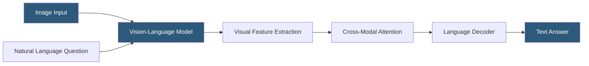

**Category:** Multimodal AI Platforms
**Difficulty:** Intermediate
**Reading time:** 6 min read

---

Visual Question Answering (VQA) is the task of answering natural language questions about image content, requiring combined visual perception and language understanding. Modern VQA systems use vision-language models (VLMs) like GPT-4V, LLaVA, or BLIP-2 to answer open-ended questions about images without task-specific training, enabling applications from automated image auditing to accessibility tools.

- **Open-ended VQA** — questions with free-form text answers (as opposed to binary yes/no)
- **Visual grounding** — locating the specific image region that contains the answer evidence
- **VQA v2** — the standard benchmark dataset for evaluating VQA model performance
- **Chain-of-thought visual reasoning** — prompting VLMs to reason step-by-step about image content
- **Referring expression comprehension** — identifying which image region a descriptive phrase refers to
- **OCR-VQA** — VQA tasks requiring reading text within the image (menus, signs, documents)
- **Multi-hop visual reasoning** — answering questions requiring combining evidence from multiple image regions

VQA is solved by modern VLMs using the same architecture as general image understanding tasks: an image encoder extracts visual features, a language model processes the question alongside the visual context, and the decoder generates a text answer. The question is typically formatted as a prompt appended to the image: "Question: What is the dominant color of the car in the parking lot? Answer:".

Question complexity varies considerably. Simple VQA tasks involve counting, color identification, or attribute recognition ("how many people are in this image?"). Complex tasks require multi-hop reasoning — combining evidence from spatial relationships, text in the image, and world knowledge ("What business does the sign in the background advertise and what are their typical business hours?"). The latter requires both OCR capability to read the sign text and world knowledge to infer business hours from context.

Chain-of-thought (CoT) prompting significantly improves performance on complex VQA tasks. By instructing the model to "think step by step" about the image before answering, the response quality on spatial reasoning and multi-object comparison tasks improves substantially. This is particularly effective with GPT-4o, Claude 3 Sonnet/Opus, and Gemini 1.5 Pro.

For production VQA pipelines, structured output formats (asking the model to respond with JSON containing `answer`, `confidence`, and `reasoning`) enable reliable downstream processing. Confidence scores allow routing uncertain answers to human review queues in high-stakes applications.

- Automating quality control by asking "does this product image show the correct label?"
- Building accessibility tools that answer questions about uploaded image content
- Automating invoice and form processing by asking structured extraction questions
- Creating interactive educational tools allowing students to query diagram content
- Implementing visual fact-checking for content moderation pipelines

| Advantage | Disadvantage |
|-----------|--------------|
| General-purpose — no task-specific training required | Complex reasoning chains increase latency and token cost |
| Works on any image type without pre-labeling | Confidence calibration is often unreliable in VLMs |
| Chain-of-thought improves accuracy for complex questions | Hallucination risk for image regions with ambiguous content |
| Structured output formats enable production-grade pipelines | OCR-heavy questions require specialized OCR-capable VLMs |

- [Image Captioning Services](image-captioning-services.md)
- [LLaVA Multimodal Deployment](llava-multimodal-deployment.md)
- [GPT-4o Multimodal API](gpt-4o-multimodal-api.md)

---
*Part of the [Multimodal AI Platforms](index.md) category · [Back to Master Index](../../index.md)*
