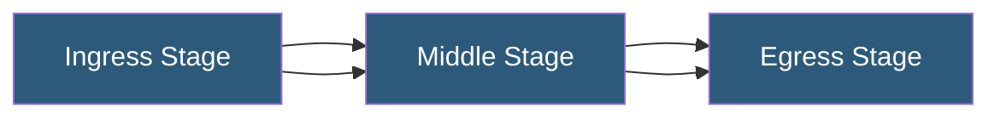

**Category:** Networking Infrastructure
**Difficulty:** Advanced
**Reading time:** 7 min read

---

CLOS networks are multi-stage non-blocking switching fabrics originally designed for telephone exchanges by Charles Clos in 1953, rediscovered and applied to datacenter networking for their ability to provide non-blocking any-to-any connectivity using many small, inexpensive switching elements rather than fewer large switches. Modern datacenter spine-leaf topologies are implementations of the CLOS architecture.

- **Non-blocking fabric** — a switching fabric where any input can be connected to any output without contention
- **Three-stage CLOS** — the classic CLOS design with ingress, middle, and egress stage switches
- **k-regular graph** — each node connects to exactly k other nodes at the same layer
- **Fat-tree topology** — a specific CLOS implementation popular in HPC and cloud datacenters
- **Benes network** — a rearrangeably non-blocking CLOS variant requiring traffic rearrangement
- **r, n, m parameters** — CLOS parameters: r middle-stage switches, n ingress ports, m ingress switches
- **Recursive CLOS** — replacing middle-stage switches with smaller CLOS networks to build multi-level fabrics

A three-stage CLOS network has three tiers of switches: ingress (input) switches, middle switches, and egress (output) switches. In the canonical design, there are m ingress switches each with n input ports and r outputs (one to each middle switch). There are r middle switches each with m input ports and m output ports. There are m egress switches mirroring the ingress switches.

The key mathematical result from Clos's 1953 paper is that strict non-blocking is achieved when r ≥ (2n - 1) — there are enough middle switches to guarantee any input can connect to any output without disturbing existing connections. When r ≥ (n - 1), the network is rearrangeably non-blocking — any connection is possible, but existing connections may need to be rerouted to accommodate new ones.

In practice, datacenter implementations use the fat-tree topology, which is a folded CLOS where the middle and egress stages are combined into a single spine layer. A k-port fat-tree using k-port switches has k/2 pods, each containing k/2 ToR switches and k/2 aggregation switches. The (k/2)² core (spine) switches provide any-to-any connectivity. A 48-port fat-tree supports 48³/4 = 27,648 servers with full bisection bandwidth — the total bandwidth at the center of the topology equals the total edge bandwidth.

Google and Facebook's datacenter networks are built on multi-level CLOS fabrics. Google's Jupiter network uses a recursive five-stage CLOS, with each level replacing middle-stage switches with smaller CLOS fabrics, enabling fabric capacities exceeding 1 petabit/second of total bisection bandwidth.

- Hyperscale datacenter fabrics requiring non-blocking connectivity at massive scale
- HPC cluster networks where all-reduce operations require full bisection bandwidth
- Any datacenter requiring predictable, consistent bandwidth between all servers
- Building large-scale AI training networks where GPUs must communicate with any other GPU at line rate
- Designing networks where the aggregate bandwidth must scale linearly with server count

| Advantage | Disadvantage |
|-----------|--------------|
| Non-blocking any-to-any connectivity | Requires many physical switches and cable connections |
| Scales to arbitrary sizes using commodity switches | Physical cabling complexity grows quadratically with scale |
| Full bisection bandwidth eliminates network bottlenecks | Implementation uses many short direct-attach cables requiring careful management |
| Theoretical framework enables rigorous capacity planning | Failure analysis requires understanding which paths are affected |

- [Spine-Leaf Network Topology](spine-leaf-network-topology.md)
- [Equal-Cost Multi-Path (ECMP) Routing](equal-cost-multi-path-ecmp-routing.md)
- [BGP Routing in Datacenters](bgp-routing-in-datacenters.md)

---
*Part of the [Networking Infrastructure](index.md) category · [Back to Master Index](../../index.md)*
