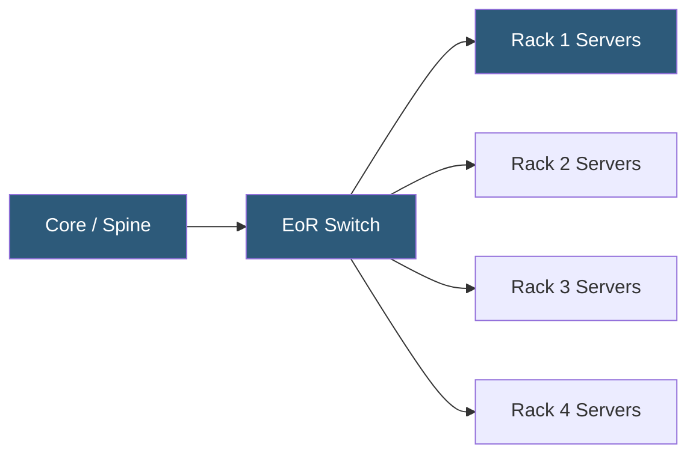

**Category:** Networking Infrastructure
**Difficulty:** Intermediate
**Reading time:** 5 min read

---

End-of-Row (EoR) switching consolidates network connections from multiple server racks in a row into a single high-port-density switch at the end of the row. This architecture reduces the number of network switches required compared to Top-of-Rack designs, but requires longer structured cable runs from servers to the EoR switch and concentrates the failure domain across an entire row.

- **EoR switch** — a high-density chassis or modular switch serving an entire row of server racks
- **Structured cabling** — pre-terminated patch cables running from server racks to a patch panel at the EoR switch
- **Patch panel** — passive termination panel at the EoR position connecting structured cabling runs
- **Row failure domain** — when the EoR switch fails, all servers in the row lose connectivity
- **Cable tray** — overhead or underfloor cable management routing cables between racks and EoR switch
- **Port density** — EoR switches typically offer 96–384 ports versus 48 for ToR switches
- **Cable run length** — 10–30 meter cable distances from servers to EoR switch requiring active optics

In EoR design, server NICs connect via structured cabling runs to a central patch panel positioned at the end of the row. From the patch panel, short cables connect to the high-port-density EoR switch. Cable runs from servers to the EoR position are typically 10–30 meters, requiring either Cat6A structured cabling for 10G copper or active optical cables (AOC) / SFP+ optical transceivers for 25G or higher speeds.

The EoR switch is usually a chassis-based or high-density fixed switch with 48–96 downlink ports per line card and a smaller number of high-speed uplinks to aggregation or spine switches. Examples include the Cisco Nexus 9500 series or Arista 7300 series chassis switches. Redundant EoR switches (or stacked units) mitigate the row-level failure domain risk.

Physical installation differs significantly from ToR: rather than quick DAC connections within a rack, EoR requires cable tray installation, structured cabling runs routed overhead or underfloor, and patch panel terminations. This increases initial installation time but keeps each rack lighter — no switch hardware required in individual racks, simplifying rack-level power and space budgets.

EoR works well in environments with legacy 10G copper cabling infrastructure, where Cat6A cable plants are already in place, or in environments prioritizing simplified management — fewer network devices to configure, update, and monitor compared to a ToR-per-rack design.

- Legacy datacenter retrofits where structured copper cabling is already installed
- Environments with lower server densities not requiring a full 48-port switch per rack
- Facilities prioritizing minimal switch count for management simplicity
- Cold/warm aisle containment designs where switches outside racks simplify thermal management
- Small colocation environments with 5–15 racks in a row

| Advantage | Disadvantage |
|-----------|--------------|
| Fewer total network devices to manage | Longer cable runs require active optics for 25G+ speeds |
| Lower total switch hardware cost at lower densities | Row-level failure domain larger than rack-level |
| No in-rack switch power consumption or heat | Structured cabling changes are more disruptive than patching at a ToR |
| Simpler network topology with fewer devices | Cable tray capacity can limit future growth |

- [Top-of-Rack (ToR) Switch Architecture](top-of-rack-tor-switch-architecture.md)
- [Spine-Leaf Network Topology](spine-leaf-network-topology.md)
- [Network Segmentation Strategies](network-segmentation-strategies.md)

---
*Part of the [Networking Infrastructure](index.md) category · [Back to Master Index](../../index.md)*
