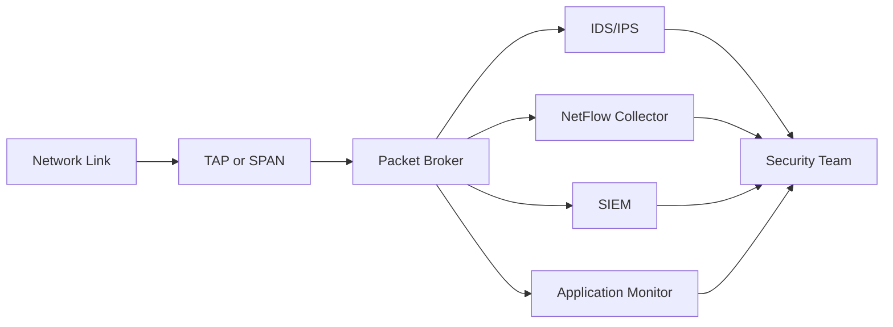

**Category:** Networking Infrastructure
**Difficulty:** Intermediate
**Reading time:** 6 min read

---

Network visibility solutions provide real-time monitoring and analysis of traffic flowing across enterprise networks. These tools capture, decode, and analyze network packets and flows to enable security monitoring, performance troubleshooting, and compliance auditing. Network visibility is foundational to modern datacenter operations and cybersecurity strategies.

- **Network TAP (Test Access Point)** — Hardware device that creates a copy of network traffic for monitoring
- **Packet Broker** — Switch-like device that intelligently routes traffic to monitoring tools
- **NetFlow/sFlow** — Aggregated flow data protocols that summarize traffic patterns without capturing full packets
- **SPAN (Switched Port Analyzer)** — VLAN-based traffic copying feature on network switches
- **Deep Packet Inspection (DPI)** — Analysis of packet payloads to identify applications and threats

Network visibility solutions operate by intercepting network traffic at strategic points and directing it to analysis tools. TAPs create non-invasive, out-of-band copies of traffic without impacting network performance or creating single points of failure. Packet brokers then intelligently filter, load-balance, and route this traffic to specialized monitoring tools like intrusion detection systems, network analyzers, and flow collectors. The traffic is simultaneously forwarded to its original destination, ensuring non-blocking operation. Modern solutions also integrate with switch SPAN features for cost savings and use metadata like NetFlow for visibility across larger networks. This multi-layered approach provides both deep packet analysis for threats and aggregate flow data for performance monitoring.

- Real-time intrusion detection and threat prevention
- Application performance monitoring and network troubleshooting
- Compliance auditing and forensic investigation
- Network baseline establishment and anomaly detection
- DDoS attack detection and mitigation
- User behavior analytics and insider threat detection

| Advantage | Disadvantage |
|-----------|--------------|
| Non-blocking, out-of-band monitoring | Hardware costs for TAPs and brokers |
| Deep packet inspection for threats | Requires dedicated monitoring infrastructure |
| Supports multiple monitoring tools simultaneously | Complex to design for very high-speed links |
| Captures encrypted and unencrypted traffic | Privacy concerns with full packet capture |
| No performance impact on production traffic | Requires skilled personnel to operate |

- [Packet brokers and TAPs](packet-brokers-and-taps.md)
- [Out-of-band management networks](out-of-band-management-networks.md)
- [Network monitoring](../monitoring-systems/network-monitoring.md)

---
*Part of the [Networking Infrastructure](index.md) category · [Back to Master Index](../../index.md)*
