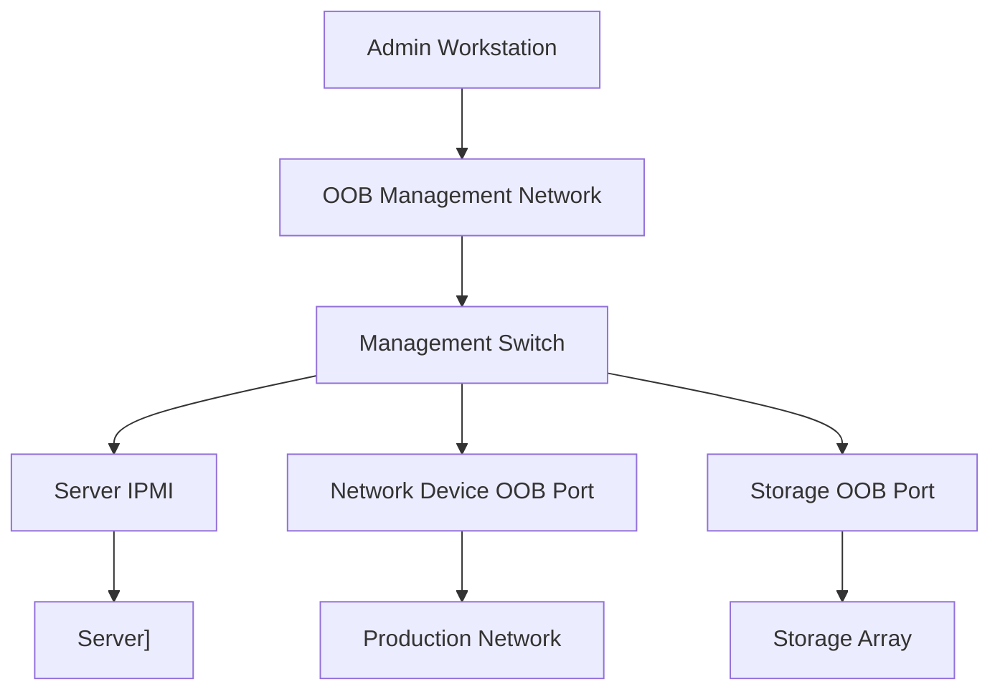

**Category:** Networking Infrastructure
**Difficulty:** Intermediate
**Reading time:** 6 min read

---

Out-of-band (OOB) management networks are separate, isolated networks used to manage infrastructure devices when the primary production network fails. These networks enable administrators to access servers, network devices, and storage systems for troubleshooting, recovery, and maintenance even during network outages. OOB networks are critical for datacenter resilience and incident response.

- **Out-of-Band Management** — Separate network path for device management independent of production
- **Lights-Out Management** — Remote access to servers via dedicated management interfaces
- **IPMI (Intelligent Platform Management Interface)** — Standard for server remote management
- **VLAN Isolation** — Separating OOB traffic from production network
- **Serial Console Access** — Fallback management method using serial connections

Out-of-band management networks use dedicated physical connections and separate infrastructure completely isolated from production networks. Each managed device includes a dedicated management interface (BMC in servers, console ports on switches) that connects to the OOB network. These interfaces remain operational even if the primary network fails, allowing access for recovery and troubleshooting. OOB networks are typically implemented on separate switches, vlans, and physical cabling to prevent compromise via the production network. Access is restricted through firewall policies and authentication. Power management, serial access, and remediation capabilities enable administrators to power cycle devices, reset configurations, or access boot logs remotely without requiring physical access to equipment.

- Emergency datacenter recovery after network outages
- Remote server reset and power management
- BIOS/firmware updates and configuration
- Accessing boot-level diagnostics and logs
- Troubleshooting network device failures
- Security incident containment and investigation

| Advantage | Disadvantage |
|-----------|--------------|
| Independent of production network health | Additional infrastructure and cabling costs |
| Enables remote recovery and remediation | Requires separate switch and IP addressing |
| Improves Mean Time To Recovery (MTTR) | More complex to manage and monitor |
| Reduces need for on-site staff during outages | Security risk if OOB network is compromised |
| Provides full device access and control | Requires additional authentication mechanisms |

- [Network visibility solutions](network-visibility-solutions.md)
- [Packet brokers and TAPs](packet-brokers-and-taps.md)
- [Datacenter network architecture](../datacenter-infrastructure/network-architecture.md)

---
*Part of the [Networking Infrastructure](index.md) category · [Back to Master Index](../../index.md)*
