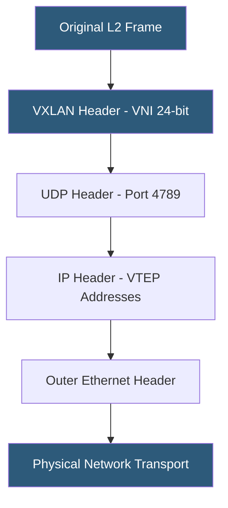

**Category:** Networking Infrastructure
**Difficulty:** Advanced
**Reading time:** 7 min read

---

Overlay networks encapsulate Layer 2 Ethernet frames or Layer 3 packets inside UDP or GRE tunnels carried over an existing IP (underlay) network. VXLAN (Virtual Extensible LAN) and NVGRE (Network Virtualization using Generic Routing Encapsulation) enable virtual networks to extend across physical datacenter boundaries and decouple virtual machine networking from physical switch topology.

- **VXLAN** — Virtual Extensible LAN; encapsulates L2 frames in UDP with a 24-bit VNI identifier
- **NVGRE** — Network Virtualization using GRE; Microsoft's overlay standard using GRE Key as VSID
- **VNI (VXLAN Network Identifier)** — a 24-bit segment ID supporting up to 16 million virtual networks
- **VTEP (VXLAN Tunnel Endpoint)** — the switch or hypervisor performing VXLAN encapsulation/decapsulation
- **Underlay network** — the physical IP network carrying the VXLAN-encapsulated traffic
- **EVPN (Ethernet VPN)** — a control plane for VXLAN that distributes MAC/IP bindings via BGP
- **Hardware VTEP** — a physical switch with ASIC-accelerated VXLAN encapsulation support

VXLAN encapsulates entire Ethernet frames (including the original source and destination MAC addresses) inside a UDP datagram. Each VXLAN segment is identified by a 24-bit Virtual Network Identifier (VNI), supporting over 16 million independent virtual networks — compared to VLAN's 4,096 limit. The VXLAN header is appended to the original frame, followed by a UDP header (destination port 4789), an outer IP header with source and destination VTEP addresses, and an outer Ethernet header for the underlay transport.

VTEPs are the encapsulation/decapsulation endpoints. They can be software-based (implemented in the hypervisor kernel's networking stack, as in Linux VXLAN or Open vSwitch) or hardware-based (ASIC-accelerated in datacenter switches like Arista, Cisco Nexus, Cumulus). When a VM on host A sends a frame to a VM on host B in the same VNI, the hypervisor VTEP on host A looks up the destination MAC's VTEP address, encapsulates the frame in VXLAN/UDP/IP, and sends it to the destination VTEP on host B over the physical underlay network.

Without a control plane, VTEPs must learn remote MAC-to-VTEP mappings through data-plane flooding (broadcasting across all VTEPs in a VNI) — inefficient at scale. EVPN (BGP-EVPN) solves this by distributing MAC and IP address bindings as BGP routes, enabling VTEPs to learn remote bindings without flooding. This is the standard production architecture: VXLAN data plane + BGP-EVPN control plane.

NVGRE uses GRE encapsulation (IP protocol 47) with a 24-bit Virtual Subnet Identifier (VSID) in the GRE Key field. It was primarily promoted by Microsoft for Hyper-V network virtualization. VXLAN has become the dominant standard due to broader vendor support and compatibility with existing UDP ECMP load balancing.

- Extending virtual machine networks across multiple physical datacenters
- Enabling overlay tenant isolation in multi-tenant cloud environments
- Decoupling VM mobility (vMotion) from physical network topology
- Building cloud-scale overlay networks without VLAN exhaustion limitations
- Providing consistent networking for container workloads (Kubernetes overlay CNIs)

| Advantage | Disadvantage |
|-----------|--------------|
| 16 million VNIs vs 4,096 VLANs enables massive multi-tenancy | 50-byte VXLAN header overhead reduces effective MTU |
| Decouples virtual topology from physical underlay | Requires EVPN control plane for efficient production deployments |
| Works over any IP-routed underlay network | Encapsulation adds CPU or ASIC processing overhead |
| Enables VM migration without L2 topology dependency | Troubleshooting overlay networks more complex than native L2 |

- [Software-Defined Networking (SDN)](software-defined-networking-sdn.md)
- [EVPN (Ethernet VPN) Technology](evpn-ethernet-vpn-technology.md)
- [BGP Routing in Datacenters](bgp-routing-in-datacenters.md)

---
*Part of the [Networking Infrastructure](index.md) category · [Back to Master Index](../../index.md)*
