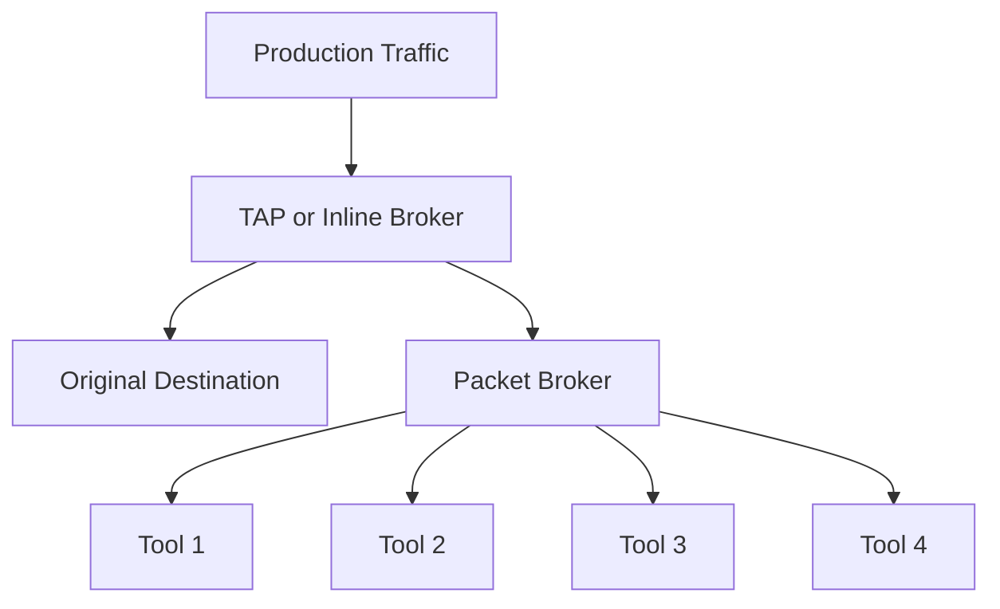

**Category:** Networking Infrastructure
**Difficulty:** Intermediate
**Reading time:** 6 min read

---

Packet brokers and Test Access Points (TAPs) are specialized network devices that enable traffic capture and distribution without impacting production networks. TAPs create passive copies of network traffic, while packet brokers intelligently filter, deduplicate, and route this traffic to multiple monitoring and security tools. Together, they form the foundation of enterprise network visibility infrastructure.

- **TAP (Test Access Point)** — Passive device that splits network traffic for monitoring
- **Packet Broker** — Intelligent distribution switch for traffic routing to tools
- **Optical TAP** — TAPs for fiber optic networks using beam splitters
- **Copper TAP** — TAPs for copper Ethernet networks
- **Tool Port** — Monitoring interface on TAP or broker where traffic is copied

TAPs operate at Layer 1 (physical layer) and create a bit-level copy of network traffic without affecting the signal or introducing latency. Optical TAPs use beam splitters to tap into fiber cables, while copper TAPs use transformer coupling. This passive approach avoids creating single points of failure and ensures traffic always reaches its destination regardless of TAP operation. Packet brokers sit downstream and receive traffic from TAPs, adding intelligence through traffic filtering, load balancing, and deduplification. Brokers can prioritize traffic to multiple tools, isolate traffic by VLAN or protocol, and provide bypass capabilities for tool maintenance. This architecture scales to support monitoring at 10G, 40G, and 100G+ speeds.

- Enabling IDS/IPS without inline blocking
- Distributing traffic to multiple security tools
- Network troubleshooting and performance analysis
- Compliance monitoring and forensics
- Load balancing traffic across monitoring devices
- Reducing monitoring tool operational costs through sharing

| Advantage | Disadvantage |
|-----------|--------------|
| Passive, non-blocking architecture | Initial capital expense for hardware |
| Supports multiple tools simultaneously | Requires careful cable management |
| No single points of failure | Bypass power needs for failsafe operation |
| Works with encrypted and unencrypted traffic | Physical space requirements in datacenters |
| Can monitor bi-directional traffic | Requires expertise to configure correctly |

- [Network visibility solutions](network-visibility-solutions.md)
- [Out-of-band management networks](out-of-band-management-networks.md)
- [Network monitoring infrastructure](../monitoring-systems/network-monitoring.md)

---
*Part of the [Networking Infrastructure](index.md) category · [Back to Master Index](../../index.md)*
