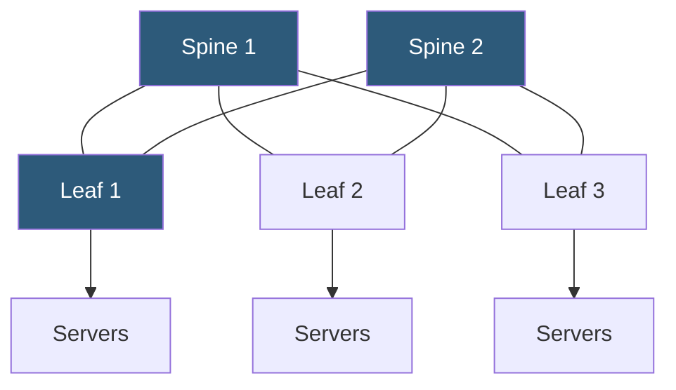

**Category:** Networking Infrastructure
**Difficulty:** Intermediate
**Reading time:** 6 min read

---

Spine-leaf is a two-tier datacenter network topology where every leaf switch connects to every spine switch, providing any-to-any connectivity with consistent, predictable latency. It replaces traditional three-tier (core-aggregation-access) designs and is the standard architecture for modern cloud and hyperscale datacenters because it scales horizontally by adding leaf and spine switches without disrupting existing connections.

- **Leaf switch** — the access layer switch connecting servers; equivalent to ToR in many deployments
- **Spine switch** — the high-speed aggregation switch that every leaf connects to
- **Full mesh** — every leaf connects to every spine, enabling equal-cost paths between any two leaves
- **ECMP (Equal-Cost Multi-Path)** — routing protocol behavior that distributes traffic across all available equal-cost paths
- **Oversubscription** — ratio of downlink bandwidth to uplink bandwidth at the leaf layer
- **East-west traffic** — server-to-server traffic within the datacenter (dominant in modern workloads)
- **North-south traffic** — traffic between the datacenter and external networks (internet, WAN)

In a spine-leaf topology, the network is divided into exactly two tiers. Leaf switches (typically 1RU 48-port switches) sit at the access layer and connect directly to servers. Spine switches (high-density 32×400G or 64×100G) form the aggregation layer. Every leaf switch has one uplink to every spine switch; if there are 4 spine switches, each leaf has 4 uplinks, one to each spine.

This full-mesh connectivity between leaves and spines means any server on leaf A can reach any server on leaf B in exactly two hops: leaf A → spine X → leaf B. Latency is predictable and consistent regardless of which servers are communicating, unlike traditional three-tier topologies where east-west traffic between aggregation domains requires 4–6 hops. Consistent hop count is essential for latency-sensitive distributed applications (databases, caches, storage).

Traffic load balancing uses ECMP at both the leaf and spine layers. When a leaf switch has a flow destined for another leaf, it hashes the flow's 5-tuple (source IP, destination IP, source port, destination port, protocol) to select one of the equal-cost spine uplinks. This distributes traffic across all available spine switches, preventing hotspots.

Scaling out adds leaf switches (new racks) without topology changes — add a leaf and connect it to all spines. Adding spine capacity requires connecting new spine switches to all existing leaves, which requires a maintenance window but is a predictable operation. The practical spine count is constrained by the number of uplink ports available on each leaf switch, typically limiting deployments to 4–8 spine switches before requiring a "super-spine" tier for very large fabrics.

- Any modern cloud or enterprise datacenter requiring scalable east-west throughput
- Microservices architectures where containers communicate heavily with each other
- Distributed storage clusters (Ceph, HDFS) with high inter-node bandwidth requirements
- HPC and AI training clusters requiring high-bandwidth low-latency interconnects
- Replacing legacy three-tier datacenter fabrics during network refresh cycles

| Advantage | Disadvantage |
|-----------|--------------|
| Consistent 2-hop east-west latency | Requires ECMP-capable switches at both tiers |
| Scales by adding leaf or spine switches | Adding spine capacity requires connecting to all leaves |
| Full mesh eliminates spanning tree issues | More physical cabling than aggregated designs |
| Equal-cost paths prevent network hotspots | Super-spine required for very large fabrics |

- [CLOS Network Architecture](clos-network-architecture.md)
- [Equal-Cost Multi-Path (ECMP) Routing](equal-cost-multi-path-ecmp-routing.md)
- [Top-of-Rack (ToR) Switch Architecture](top-of-rack-tor-switch-architecture.md)

---
*Part of the [Networking Infrastructure](index.md) category · [Back to Master Index](../../index.md)*
