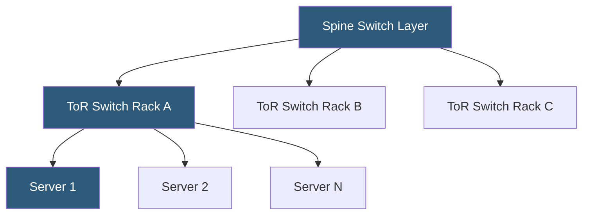

**Category:** Networking Infrastructure
**Difficulty:** Intermediate
**Reading time:** 6 min read

---

Top-of-Rack (ToR) switching places a network switch at the top of each server rack, with short copper or DAC cables running down to servers within the same rack. This architecture minimizes cabling complexity, reduces latency, and simplifies network management by creating a clear physical demarcation between in-rack and inter-rack connectivity.

- **ToR switch** — a 1U or 2U switch installed at the top of a server rack connecting up to 48 servers
- **DAC cable (Direct Attach Copper)** — passive twinax copper cable for short-distance (≤7m) high-speed connections
- **Uplink ports** — higher-speed ports (40G, 100G) connecting the ToR switch to aggregation or spine switches
- **Oversubscription** — the ratio of access port bandwidth to uplink bandwidth (e.g., 48×10G downlinks / 4×40G uplinks = 3:1)
- **In-rack cabling** — short server-to-switch cables kept within the rack enclosure
- **Breakout cable** — a cable splitting one 100G QSFP port into four 25G SFP+ ports
- **Power budget** — total ToR switch power consumption (typically 200–600W per switch)

In a ToR architecture, each server rack contains a dedicated switch positioned at the top. Servers connect to this switch via short DAC cables (for 10G/25G links) or optical transceivers, with cable lengths of 1–3 meters being typical. The ToR switch aggregates all server traffic within the rack onto a smaller number of higher-speed uplink ports (typically 4×40G or 2×100G) connecting to aggregation or spine-layer switches.

This design offers several operational advantages. Physical cabling is dramatically simplified compared to End-of-Row or aggregation-only designs: servers connect to a local switch, and only the uplink cables leave the rack. Cable management is contained within each rack, making additions, replacements, and troubleshooting straightforward. The short copper DAC connections within the rack are passive and low-latency, avoiding the power and cost overhead of active optical transceivers for in-rack links.

ToR switches are typically 1RU (1 rack unit) 48-port devices with 48 downlink ports (10G or 25G) and 4–8 uplink ports (40G or 100G). Modern ToR switches (Arista 7050CX3, Cisco Nexus 93180, Dell Z9264) support ECMP, VXLAN termination, and BGP routing, enabling the switch to participate directly in the spine-leaf fabric rather than operating as a simple L2 switch.

Oversubscription is an inherent design trade-off: 48 server ports at 10Gbps = 480Gbps total access bandwidth, typically connected via 4×40Gbps = 160Gbps uplinks, yielding 3:1 oversubscription. For most workloads, not all servers transmit simultaneously, so this is acceptable. Latency-sensitive or high-bandwidth HPC workloads may require lower oversubscription ratios.

- Standard datacenter rack deployments with 20–48 servers per rack
- Hyperscale datacenter designs requiring predictable, scalable cabling
- Spine-leaf fabric deployments where every ToR switch connects to every spine
- High-density server environments with 25G or 100G server NICs
- Modular datacenter deployments where racks are self-contained units

| Advantage | Disadvantage |
|-----------|--------------|
| Simplified in-rack cabling with short DAC connections | More total switch hardware than End-of-Row designs |
| Clear failure domain — one switch affects one rack | Higher power consumption per rack |
| Easy rack-level management and troubleshooting | Uplink oversubscription may constrain east-west traffic |
| Scales horizontally by adding racks with ToR switches | More MAC addresses and routing state to manage at scale |

- [Spine-Leaf Network Topology](spine-leaf-network-topology.md)
- [End-of-Row (EoR) Switch Design](end-of-row-eor-switch-design.md)
- [Equal-Cost Multi-Path (ECMP) Routing](equal-cost-multi-path-ecmp-routing.md)

---
*Part of the [Networking Infrastructure](index.md) category · [Back to Master Index](../../index.md)*
