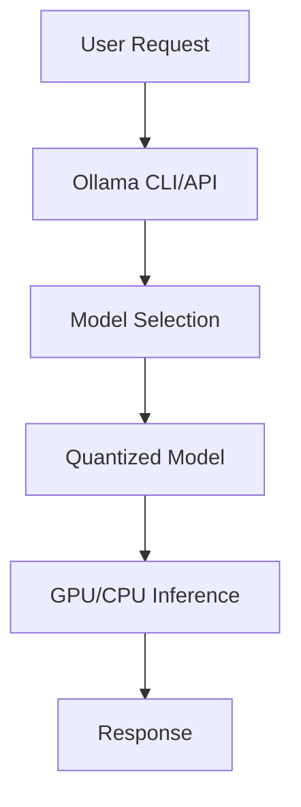

**Category:** Open Source Model Hosting
**Difficulty:** Intermediate
**Reading time:** 6 min read

---

Ollama is a lightweight framework for running open source language models locally on your machine. It simplifies the process of downloading, configuring, and running models like Llama, Mistral, and others without cloud dependencies.

- **Local Inference** — running models on your hardware
- **Model Library** — curated collection of available models
- **CLI Interface** — command-line tool for model management
- **REST API** — HTTP server for integration
- **Resource Efficiency** — optimized for consumer hardware

Ollama provides a command-line interface for downloading and running language models locally. You download a model using `ollama pull modelname` which fetches the model and stores it locally. Models are quantized to reduce file size and memory requirements, enabling them to run on consumer hardware. Ollama automatically detects available GPU and uses it if present, falling back to CPU. You interact with models through the CLI for immediate testing or through a REST API endpoint for application integration. The API is compatible with OpenAI client libraries with minimal code changes. Models run with automatic GPU offloading and memory management. Ollama maintains a model library with hundreds of open source models.

- Running language models without cloud API costs
- Private local LLM inference
- Fine-tuning models on proprietary data
- Developing LLM applications locally
- Running models offline without internet

| Advantage | Disadvantage |
|-----------|--------------|
| No cloud dependency | Hardware requirements |
| Privacy and data control | Slower than cloud APIs |
| No API costs | Model quality varies |
| Simple setup | Limited model selection vs commercial |
| Open source | Maintenance responsibility |

- [Ollama model library](ollama-model-library.md)
- [Ollama REST API](ollama-rest-api.md)
- [LM Studio desktop application](lm-studio-desktop-application.md)

---
*Part of the [Open Source Model Hosting](open-source-model-hosting/index.md) category · [Back to Master Index](../../index.md)*
