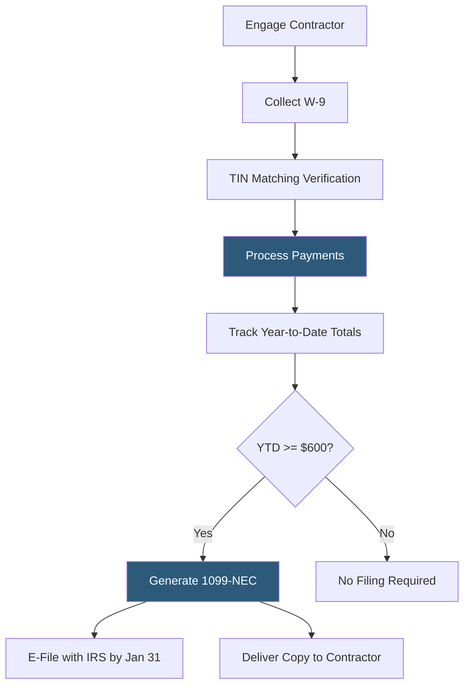

**Category:** Payroll Platforms
**Difficulty:** Beginner
**Reading time:** 5 min read

---

1099 contractor management refers to the systems and processes businesses use to engage, pay, and fulfill tax obligations for independent contractors — named for the IRS Form 1099-NEC used to report non-employee compensation. Effective contractor management encompasses W-9 collection, payment tracking, compliance verification, and year-end tax form generation. As the freelance and gig economy grows, businesses increasingly need systematic approaches to managing large contractor populations that would overwhelm manual spreadsheet-based processes.

- **Form 1099-NEC** — the IRS tax form reporting non-employee compensation; required for any contractor paid $600 or more in a calendar year
- **Form W-9** — the IRS form contractors complete providing their name, address, and taxpayer identification number (TIN) before payments begin
- **TIN Matching** — the IRS program allowing businesses to verify contractor-provided Social Security Numbers or EINs before filing 1099s
- **Backup Withholding** — the 24% tax rate applied to contractor payments when required tax information is missing or fails verification
- **Independent Contractor Agreement** — a contract defining the scope, payment terms, and classification criteria of the contractor relationship
- **Worker Misclassification** — the IRS and state risk of classifying a worker as a contractor when the control tests indicate they should be an employee
- **Accounts Payable Integration** — connecting contractor payment tracking to AP systems ensures accurate year-to-date totals for 1099 threshold determination
- **E-Filing** — electronic submission of 1099-NEC forms to the IRS through the FIRE system or payroll/AP platforms with built-in e-filing

Effective 1099 contractor management starts before the first payment. Before paying a new contractor, businesses should collect a completed W-9, which provides the legal name, business name, address, TIN, and entity type (individual/sole proprietor, LLC, corporation). Corporations are generally exempt from 1099 requirements, but the W-9 documents this determination. The IRS offers a free TIN matching program, and many payroll/AP platforms integrate this verification automatically.

Throughout the year, all payments to each contractor must be tracked with precision. Payments include not just invoiced fees but also any reimbursements that are considered contractor income under the agreement terms. Many businesses fail at this step by paying contractors through multiple channels (ACH, check, credit card, PayPal) without aggregating totals — credit card and PayPal payments are reportable under Form 1099-K with different thresholds, creating complexity.

At year-end, the platform compares each contractor's year-to-date payments to the $600 threshold. For those meeting or exceeding it, a 1099-NEC is generated with Box 1 showing the total non-employee compensation. The IRS deadline for filing and distributing 1099-NEC is January 31, covering both e-file and paper delivery.

Penalties for missing or incorrect 1099 filings range from $50 to $290 per form depending on how late the correction is made. Systematic tracking through payroll or AP platforms eliminates these penalties.

Backup withholding applies when a contractor doesn't provide a W-9 within a specified period or when TIN matching fails. The business must withhold 24% from payments and remit it to the IRS using Form 945.

- Companies with growing freelance rosters needing systematic W-9 collection and payment tracking
- Finance teams wanting automated 1099 generation to eliminate December scramble
- Platforms paying large volumes of gig workers needing scalable compliance processes
- Small businesses replacing spreadsheet contractor tracking with a managed solution
- AP departments wanting TIN verification to prevent backup withholding obligations

| Advantage | Disadvantage |
|-----------|--------------|
| Automated tracking prevents missed 1099 filings and IRS penalties | Initial contractor data cleanup needed if records were previously fragmented |
| W-9 self-service portals reduce administrative collection work | Does not address underlying misclassification risk if contractor tests aren't met |
| TIN matching catches errors before filing, avoiding correction penalties | Platforms charge per-contractor fees at scale that add cost |
| E-filing handles IRS submission deadlines automatically | Payment method fragmentation (credit cards, PayPal) can still produce 1099-K complications |

- [Contractor Payment Platforms](contractor-payment-platforms.md)
- [Gusto Contractor Payments](gusto-contractor-payments.md)
- [W-2 Employee Management](w-2-employee-management.md)

---
*Part of the [Payroll Platforms](index.md) category · [Back to Master Index](../../index.md)*
