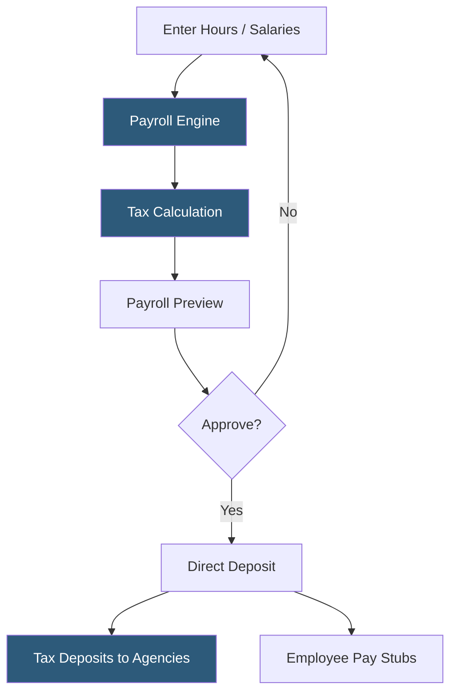

**Category:** Payroll Platforms
**Difficulty:** Beginner
**Reading time:** 5 min read

---

ADP RUN is a cloud-based payroll and HR platform built specifically for small businesses with 1–49 employees, offering automated payroll processing, tax filing, and compliance management without requiring dedicated HR staff. The platform handles all federal, state, and local tax calculations and filings automatically, reducing the administrative burden on small business owners. Its guided payroll workflow lets users run payroll in minutes once the initial setup is complete.

- **Payroll Run** — the end-to-end process of calculating employee wages, deductions, and taxes and initiating payment for a pay period
- **Direct Deposit** — electronic transfer of net pay directly into employee bank accounts on payday
- **Tax Filing Service** — ADP's automated system that calculates, deposits, and files payroll taxes with government agencies on behalf of the employer
- **New Hire Reporting** — mandatory state-level reporting of newly hired employees, automated by ADP RUN
- **Payroll Preview** — a pre-submission review step showing all wages, deductions, and net pay before final processing
- **Off-Cycle Payroll** — ad hoc payroll runs outside the normal schedule for bonuses, commissions, or corrections
- **Deduction Codes** — configurable categories for pre- and post-tax deductions such as health insurance, 401(k), and garnishments
- **Workers' Comp Pay-As-You-Go** — an ADP feature that ties workers' compensation premiums to actual payroll data each pay period

ADP RUN operates on a guided payroll workflow designed for non-payroll specialists. Once the business is set up with employee data, pay schedules, and tax information, running payroll follows a three-step process: enter or confirm hours and salaries, review the payroll summary, and approve for processing.

Under the hood, RUN's tax engine references continuously updated federal and state tax tables. It calculates FICA (Social Security and Medicare), federal income tax withholding, and all applicable state and local taxes for each employee, accounting for filing status, allowances, and year-to-date earnings for FICA wage base limits.

After approval, ADP initiates ACH transfers for direct deposit, typically delivering funds on the scheduled payday (with a 2-day lead time for standard processing, or next-day with the premium tier). Tax deposits are made according to the employer's deposit schedule (semi-weekly or monthly depending on tax liability size), and ADP files 941, 940, W-2, and state forms automatically.

The HR+ and Complete tiers add features like an employee handbook builder, job postings, onboarding workflows, and time tracking integration. RUN also integrates with QuickBooks and other accounting software to push payroll journal entries automatically after each run.

- Small businesses running payroll for hourly and salaried employees under one roof
- Restaurants and retail businesses with variable hours needing quick payroll runs
- Companies transitioning from manual payroll or spreadsheet-based processing
- Businesses that need automated tax filing without hiring a dedicated payroll specialist
- Small employers who want workers' comp premiums tied to actual payroll

| Advantage | Disadvantage |
|-----------|--------------|
| Simple guided interface designed for non-experts | Limited scalability beyond 49 employees; transitions to Workforce Now |
| Automated tax filing eliminates compliance risk | Pricing is quote-based and can be expensive for very small teams |
| Strong integration with QuickBooks | Customer support response times can be slow |
| Mobile app for approvals on the go | Less feature-rich than enterprise ADP platforms |

- [ADP Workforce Now](adp-workforce-now.md)
- [Gusto Payroll Platform](gusto-payroll-platform.md)
- [QuickBooks Payroll](quickbooks-payroll.md)

---
*Part of the [Payroll Platforms](index.md) category · [Back to Master Index](../../index.md)*
