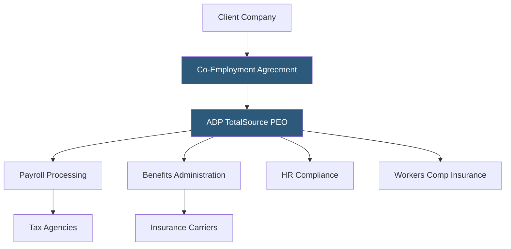

**Category:** Payroll Platforms
**Difficulty:** Advanced
**Reading time:** 6 min read

---

ADP TotalSource is a Professional Employer Organization (PEO) that enters a co-employment relationship with client companies, taking on employer responsibilities for payroll, benefits, HR compliance, and risk management. As one of the largest PEOs in the United States, TotalSource gives small and mid-sized businesses access to Fortune 500-level benefits and expert HR services without building an in-house HR department. The co-employment model allows ADP to pool thousands of businesses into a single benefits purchasing group, significantly reducing insurance costs.

- **PEO (Professional Employer Organization)** — a firm that co-employs a client's workforce, assuming employer responsibilities for payroll taxes, benefits, and compliance
- **Co-Employment** — a legal arrangement where the PEO and client company share employer responsibilities; the PEO handles HR administration, the client retains operational control
- **Employer of Record (EOR)** — the entity legally responsible for employment taxes and compliance; in a PEO relationship, the PEO becomes the EOR for tax purposes
- **Master Health Plan** — a large group health insurance policy held by the PEO that clients access, often at lower rates than small groups can obtain independently
- **SUI Rate Management** — the PEO aggregates State Unemployment Insurance tax experience across clients, potentially reducing individual employer SUI rates
- **Workers' Comp Coverage** — TotalSource provides workers' compensation insurance under its own policy, simplifying claims management
- **HR Business Partner** — a dedicated HR expert assigned to each TotalSource client for guidance on compliance, policy, and employee relations
- **ESAC Accreditation** — Employer Services Assurance Corporation certification indicating a PEO meets financial and ethical standards

When a company joins ADP TotalSource, it signs a co-employment agreement that legally designates TotalSource as the employer of record for tax and benefits purposes. The client company retains full control over hiring, firing, day-to-day management, and business operations — the PEO relationship is invisible to customers and business operations.

TotalSource absorbs all payroll administration: calculating wages and taxes, remitting payroll taxes under its own EIN, filing quarterly and annual tax forms, and issuing W-2s. Because all employees across thousands of TotalSource clients are pooled under a single large-group benefits plan, TotalSource can negotiate significantly better health insurance rates than a 20-person company could obtain independently.

Compliance management is a core value proposition. TotalSource monitors federal and state labor law changes, updates employee handbooks, manages OSHA recordkeeping, handles unemployment claims, and provides guidance during audits. The dedicated HR Business Partner acts as an on-call HR department for client management teams.

Risk management services include employment practices liability insurance (EPLI) and assistance with workplace investigations. When clients grow beyond the PEO model or need to exit, TotalSource facilitates the transition to standalone HR infrastructure.

- Small businesses (5–150 employees) that want enterprise-level benefits without HR overhead
- Companies in regulated industries needing continuous compliance monitoring
- Fast-growing startups that need to scale HR administration without hiring HR staff
- Businesses wanting to offer competitive benefits to attract talent in tight labor markets
- Companies looking to offload workers' comp insurance management and claims

| Advantage | Disadvantage |
|-----------|--------------|
| Access to large-group health insurance rates reduces benefits costs | Co-employment relationship requires legal understanding and due diligence |
| Dedicated HR expertise without hiring HR staff | PEO fees (typically 2–12% of payroll) add cost at scale |
| Comprehensive compliance monitoring across all 50 states | Less flexibility in benefits customization compared to standalone plans |
| Workers' comp and EPLI coverage included | Exiting a PEO requires re-establishing independent employer accounts |

- [ADP Workforce Now](adp-workforce-now.md)
- [Justworks PEO Platform](justworks-peo-platform.md)
- [TriNet PEO Services](trinet-peo-services.md)

---
*Part of the [Payroll Platforms](index.md) category · [Back to Master Index](../../index.md)*
