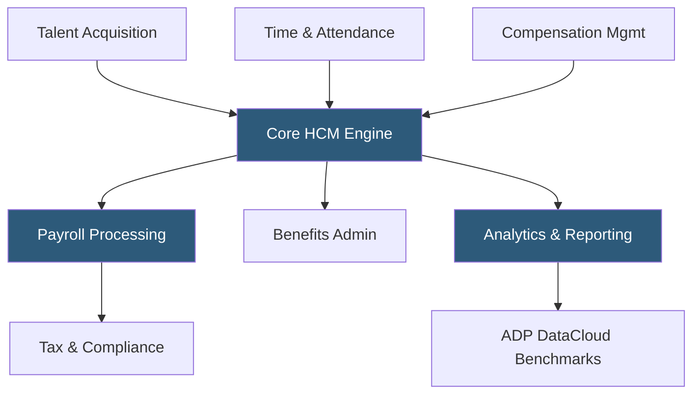

**Category:** Payroll Platforms
**Difficulty:** Advanced
**Reading time:** 6 min read

---

ADP Vantage HCM is an enterprise-grade human capital management platform designed for large organizations with 1,000 or more employees, offering deeply integrated payroll, talent management, workforce management, and analytics capabilities. Unlike the mid-market Workforce Now, Vantage provides highly configurable business rules engines, advanced role-based security, and dedicated implementation teams for complex organizational structures. The platform emphasizes continuous payroll processing and real-time data across the entire employee lifecycle.

- **Continuous Payroll** — a processing model where payroll calculations run throughout the pay period rather than only at period-end, reducing last-minute processing risks
- **Role-Based Security** — granular permission matrices controlling what data each user role can view, edit, or approve based on organizational hierarchy
- **Business Rules Engine** — a configurable logic layer that automates approvals, notifications, and data validation based on organizational policies
- **Talent Acquisition Suite** — integrated ATS (Applicant Tracking System) and onboarding tools within the Vantage ecosystem
- **Succession Planning** — tools to identify high-potential employees and map career paths to critical leadership roles
- **Compensation Management** — merit cycle administration, bonus planning, and salary benchmarking integrated with payroll data
- **Global Payroll Connector** — integration framework connecting Vantage to ADP's country-specific payroll engines for multinational operations
- **DataCloud Analytics** — ADP's workforce benchmarking database that compares organizational metrics against anonymized industry peers

ADP Vantage HCM is built on a unified data model where every HR transaction — from hire to retire — updates a single system of record. This eliminates reconciliation between separate systems and provides real-time headcount and cost data to finance and HR leaders.

The payroll engine supports highly complex configurations: multiple pay groups with different frequencies, union contract rules, piece-rate and commission structures, multi-state allocations for employees working in multiple jurisdictions, and intricate deduction priority rules. Continuous payroll processing means the engine can calculate estimated pay at any point in the period, alerting HR teams to anomalies before the final run.

Vantage's talent management modules are tightly coupled to payroll. When a promotion is approved in the talent module, compensation changes flow automatically to payroll effective the correct date. Performance ratings feed directly into merit increase calculations. Succession plans draw on current compensation data to model promotion costs.

Implementation of Vantage typically involves a dedicated ADP project team working alongside client IT and HR for 6–12 months. ADP provides a dedicated service team post-implementation rather than the standard support queue model used for smaller platforms.

- Large enterprises (1,000+ employees) with complex organizational structures
- Companies with union workforces requiring contract-specific pay rules
- Organizations running international operations needing a global HCM hub
- Enterprises wanting talent and compensation data tightly coupled to payroll
- Companies requiring sophisticated workforce analytics and peer benchmarking

| Advantage | Disadvantage |
|-----------|--------------|
| Unified data model eliminates reconciliation across HR functions | Requires 6–12 month implementation engagement |
| Highly configurable for complex pay rules and org structures | High total cost of ownership compared to mid-market alternatives |
| Dedicated post-implementation service team | Overkill for organizations under 500 employees |
| Continuous payroll reduces period-end risk | Requires dedicated IT and HR resources to manage the platform |

- [ADP Workforce Now](adp-workforce-now.md)
- [Workday HCM Payroll](workday-hcm-payroll.md)
- [UKG Pro](ukg-pro.md)

---
*Part of the [Payroll Platforms](index.md) category · [Back to Master Index](../../index.md)*
