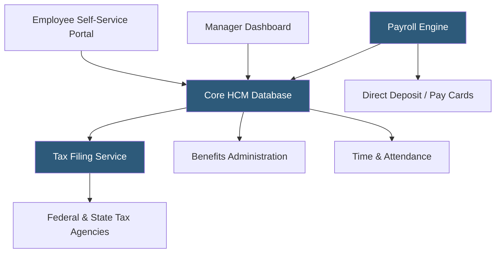

**Category:** Payroll Platforms
**Difficulty:** Intermediate
**Reading time:** 6 min read

---

ADP Workforce Now is a cloud-based human capital management (HCM) suite designed for mid-sized to large enterprises, integrating payroll processing, HR management, benefits administration, and workforce analytics into a single platform. It automates complex payroll calculations including tax withholdings, garnishments, and multi-state filings while maintaining compliance with federal and state regulations. The platform's unified data model eliminates double entry and provides real-time visibility across the employee lifecycle.

- **HCM (Human Capital Management)** — an integrated suite covering payroll, HR, talent, benefits, and time management in one system
- **Employee Self-Service (ESS)** — a portal where employees view pay stubs, update personal info, and request time off without HR intervention
- **Tax Filing Service** — ADP's automated service that calculates, deposits, and files federal, state, and local payroll taxes on the employer's behalf
- **Wage Garnishments** — court-ordered deductions from employee pay (child support, tax levies) automatically calculated and remitted
- **GL (General Ledger) Integration** — automated export of payroll journal entries to accounting systems like QuickBooks, SAP, or Oracle
- **Workforce Analytics** — embedded dashboards showing headcount trends, turnover rates, and compensation benchmarking
- **ADP Marketplace** — an ecosystem of third-party HR app integrations via pre-built connectors
- **PTO Accruals** — configurable rules that automatically track and accrue paid time off balances based on tenure or hours worked

ADP Workforce Now processes payroll through a multi-step calculation engine. When a pay run is initiated, the system aggregates data from integrated time and attendance modules, applies earnings codes (regular, overtime, shift differentials), and runs each employee record through a tax calculation engine that references constantly updated federal and state tax tables.

The platform supports an unlimited number of pay groups with configurable pay frequencies (weekly, bi-weekly, semi-monthly, monthly). Each pay group can have distinct GL mapping rules, so payroll journal entries post automatically to the correct cost centers in downstream accounting systems.

For tax compliance, ADP maintains a dedicated team that monitors legislative changes across all 50 states plus localities. Tax table updates deploy automatically, removing the compliance burden from HR teams. The platform handles new hire reporting (required within days of hire in most states), W-2 distribution, ACA (Affordable Care Act) 1095-C reporting, and year-end reconciliation.

The benefits module connects to insurance carriers via EDI (Electronic Data Interchange) 834 transactions, automatically enrolling employees and processing qualifying life events. Time-off accruals run as background jobs that update balances based on configurable policy rules.

ADP's mobile app gives employees access to pay stubs, W-2s, and time-off requests, while managers can approve timesheets and run ad hoc reports from anywhere.

- Mid-market companies (50–1,000 employees) needing a unified HR and payroll platform
- Businesses with complex multi-state or multi-country payroll requirements
- Organizations that have outgrown basic payroll tools and need embedded analytics
- Companies requiring automated ACA compliance tracking and reporting
- Enterprises integrating payroll with ERP systems like SAP or Oracle

| Advantage | Disadvantage |
|-----------|--------------|
| Comprehensive all-in-one HCM reduces vendor sprawl | Higher cost than standalone payroll tools like Gusto |
| Automated tax compliance across all 50 states | Implementation can take 3–6 months for full configuration |
| Scalable from 50 to 100,000+ employees | Interface can feel complex for small HR teams |
| Deep integration ecosystem via ADP Marketplace | Customer support quality varies by account tier |

- [Paychex Flex Payroll](paychex-flex-payroll.md)
- [Gusto Payroll Platform](gusto-payroll-platform.md)
- [Workday HCM Payroll](workday-hcm-payroll.md)

---
*Part of the [Payroll Platforms](index.md) category · [Back to Master Index](../../index.md)*
