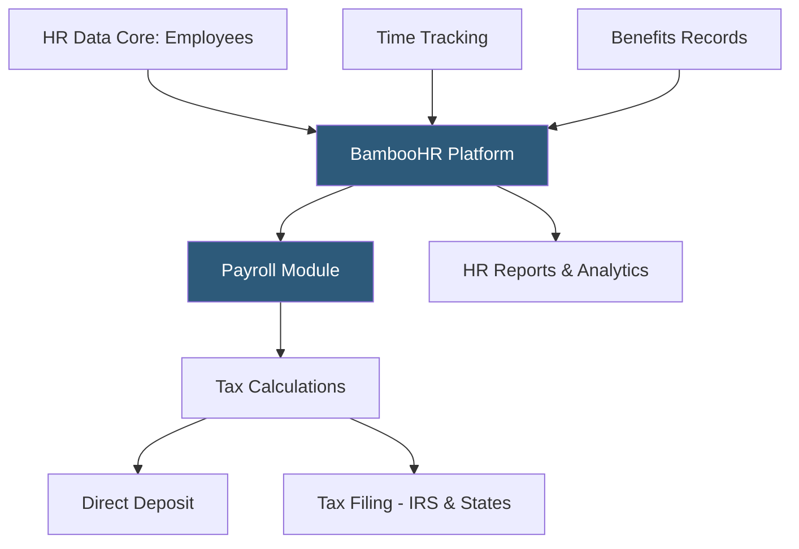

**Category:** Payroll Platforms
**Difficulty:** Beginner
**Reading time:** 5 min read

---

BambooHR is primarily an HRIS (Human Resources Information System) for small and mid-sized businesses that added a native payroll module to complement its HR data management, time tracking, and reporting capabilities. While BambooHR is best known for its intuitive HR platform covering hiring, onboarding, and performance, its payroll module enables US-based companies to run payroll directly within BambooHR rather than integrating with a separate payroll service. The platform targets companies of 25–500 employees that want their HR data and payroll in one system.

- **HRIS Core** — BambooHR's central employee record system storing employment history, compensation, benefits, and personal information
- **BambooHR Payroll** — the native US payroll module that processes wages, taxes, and direct deposit within BambooHR
- **Time Tracking** — hourly time capture with overtime calculation, available as an add-on to the base HR platform
- **Benefits Tracking** — recording of benefits elections and deductions within BambooHR, synced to payroll calculations
- **Reporting** — BambooHR's strengths include flexible HR reports; payroll adds compensation and headcount cost reporting
- **Pre-Tax Deductions** — management of 401(k), FSA, HSA, and health insurance deductions within the payroll module
- **Payroll Tax Filing** — automated federal and state tax calculations and filings through the payroll module
- **Third-Party Payroll Integration** — BambooHR also integrates with external payroll systems for companies not using the native module

BambooHR's HR platform serves as the employee data foundation. When the payroll module is added, it draws directly from this record — employee classifications, compensation rates, department assignments, and deduction elections — without requiring separate data entry in a payroll system.

Running payroll in BambooHR involves confirming hours for hourly employees (from time tracking or manual entry), reviewing deductions and any off-cycle items, and approving the run. The payroll engine calculates gross wages, applies all pre- and post-tax deductions, determines tax withholding based on W-4 elections, and calculates employer-side taxes (FICA match, FUTA, SUTA).

Tax deposits are made to federal and state agencies according to the required deposit schedule, and quarterly and annual returns (941, 940, W-2, state equivalents) are filed automatically. BambooHR maintains current tax tables and compliance updates.

For companies that prefer to keep their existing payroll provider, BambooHR offers two-way integrations with ADP, Gusto, QuickBooks Payroll, and others. Employee changes in BambooHR sync to the external payroll system, reducing duplicate entry. This makes BambooHR valuable as an HRIS even without switching payroll.

The reporting capabilities that make BambooHR well-regarded in the HRIS market extend to payroll data when the native module is used, enabling combined headcount-and-cost reports that are harder to produce when HR data and payroll data live in separate systems.

- Small-to-mid businesses that already use BambooHR for HR and want to consolidate payroll
- Companies that value BambooHR's reporting capabilities applied to combined HR and payroll data
- Organizations wanting one vendor relationship for HRIS and payroll
- Businesses using BambooHR as HRIS with external payroll, wanting data sync to reduce manual entry
- HR-driven organizations where HRIS features matter more than payroll complexity

| Advantage | Disadvantage |
|-----------|--------------|
| Unified HR data and payroll eliminates sync between separate systems | Native payroll module is US-only; no international payroll capability |
| BambooHR's renowned reporting extends to payroll cost data | Payroll module functionality less mature than dedicated payroll platforms |
| Intuitive interface that non-technical HR teams find accessible | Not suitable for complex enterprise payroll scenarios |
| Strong third-party payroll integrations if native module is insufficient | Add-on pricing for payroll on top of existing HRIS subscription cost |

- [Gusto Payroll Platform](gusto-payroll-platform.md)
- [Rippling Payroll & HR](rippling-payroll-hr.md)
- [Namely Payroll Platform](namely-payroll-platform.md)

---
*Part of the [Payroll Platforms](index.md) category · [Back to Master Index](../../index.md)*
