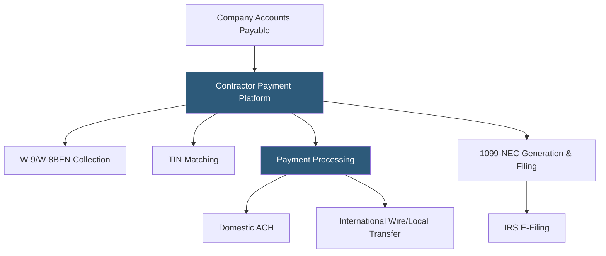

**Category:** Payroll Platforms
**Difficulty:** Intermediate
**Reading time:** 6 min read

---

Contractor payment platforms specialize in managing payments to independent contractors, freelancers, and gig workers — both domestically and internationally — with automated 1099/tax form generation, compliance verification, and multi-currency payment capabilities. Unlike full payroll platforms designed for W-2 employees, contractor platforms focus on the unique requirements of non-employee workforces: collecting W-9 or W-8BEN tax forms, verifying contractor classification, processing high-volume payments to many recipients, and handling cross-border payments.

- **W-9 Collection** — the IRS form independent contractors complete to certify their taxpayer identification; contractor platforms automate collection and storage
- **W-8BEN** — the IRS form international contractors complete to certify foreign status and claim applicable tax treaty benefits
- **TIN Matching** — verifying contractor-provided tax identification numbers against IRS records to prevent mismatched 1099 filings
- **1099-NEC Filing** — the annual information return filed for each contractor receiving $600 or more; contractor platforms generate and file these automatically
- **Backup Withholding** — mandatory 24% withholding applied to payments when a contractor fails TIN matching or doesn't provide tax information
- **Mass Payments** — the ability to pay hundreds or thousands of contractors simultaneously via batch ACH, wire, or PayPal
- **Contractor Misclassification** — the legal risk of treating employees as contractors to avoid payroll taxes; some platforms include classification compliance checks
- **Global Payouts** — payment networks enabling contractor payment in 100+ countries and local currencies

Contractor payment platforms operate as payment orchestration layers between companies and their contractor networks. When a contractor is added to the platform, the system sends an automated request for the appropriate tax form: W-9 for US-based contractors or W-8BEN for foreign contractors. Many platforms perform real-time TIN matching against the IRS database to verify the information before any payments are processed.

Payment processing varies by platform architecture. High-volume platforms like Tipalti or Bill.com support batch payment runs where thousands of contractor invoices are approved and paid simultaneously through ACH, check, PayPal, wire transfer, or local bank transfer in each contractor's country. International payment routing optimizes for cost and speed — using local payment rails when available (SEPA for Europe, BACS for UK) rather than expensive international wire transfers.

Tax compliance is automated throughout the year. The platform tracks year-to-date payments to each contractor and flags those approaching the $600 1099 threshold. At year-end, 1099-NEC forms are generated, e-filed with the IRS by the January 31 deadline, and distributed to contractors electronically. If a contractor failed TIN matching, backup withholding is applied to all payments and reported on Form 945.

Leading contractor payment platforms include Tipalti (enterprise AP automation with contractor support), Deel (contractor-focused, especially international), Gusto Contractor Payments, and traditional payroll platforms that have added contractor modules.

- Companies with large freelance networks (content creators, developers, designers) needing scalable payment processing
- Platforms operating gig marketplaces paying thousands of workers globally
- AP departments wanting to automate 1099 collection and filing across a large contractor base
- Companies expanding internationally and needing to pay contractors in multiple currencies
- Businesses wanting automated TIN matching to prevent 1099 mismatch penalties

| Advantage | Disadvantage |
|-----------|--------------|
| Automated W-9 collection and TIN matching reduces IRS penalty exposure | Contractor-only platforms may create integration work when company also has employees |
| Mass payment capabilities scale to thousands of contractors simultaneously | Some platforms charge per-contractor fees that become significant at scale |
| International payment optimization reduces wire transfer costs | Does not address the underlying risk if contractors are actually misclassified employees |
| Automated 1099 filing eliminates year-end compliance scramble | Data residency requirements for international contractor data add compliance complexity |

- [1099 Contractor Management](1099-contractor-management.md)
- [Gusto Contractor Payments](gusto-contractor-payments.md)
- [International Payroll Platforms](international-payroll-platforms.md)

---
*Part of the [Payroll Platforms](index.md) category · [Back to Master Index](../../index.md)*
